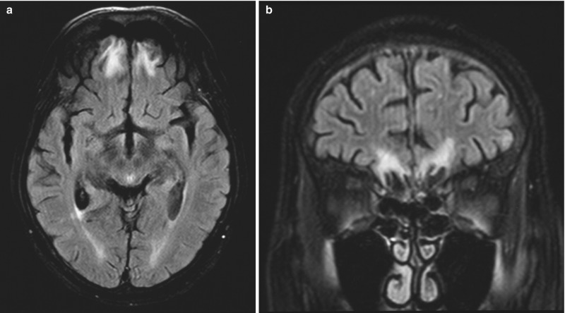
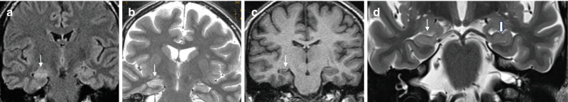
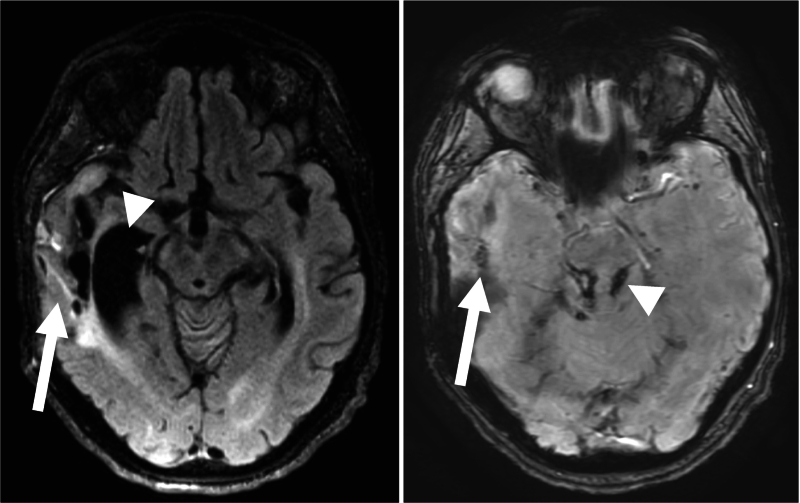

# Gliosis In The Brain

Prototype disease chapter for the proposed `clinical-statistical-expert` skill.

## Goals

This disease chapter is designed to help a clinical-statistical reviewer:

1. Given a known diagnosis or suspected disease context, describe how gliosis
   commonly presents on diagnostic imaging, especially MRI, using clinically
   realistic radiology-report language.
2. When reviewing diagnostic images or radiology reports, identify the imaging
   features, locations, structural patterns, report phrases, and clinical
   context that support or argue against gliosis relative to similar-appearing
   conditions.
3. Translate gliotic appearance, report language, disease course, and diagnostic
   uncertainty into research-design and statistical implications, including
   cohort definition, endpoint selection, covariates, adjudication,
   misclassification risk, and claims language.

## Source Review Status

This chapter is an evidence-backed draft with an expanded source and image
evidence set. The current evidence manifests record 38 source entries and 54
image candidates, including 3 locally embedded images with explicit reuse
permission. The source set is now broad enough for a serious clinical-review
pass, but the chapter is still developing because several contexts need more
line-by-line extraction into report-style language.

The strongest open support currently comes from NCBI Bookshelf/Springer
textbook-style chapters, professional appropriateness criteria, radiology
teaching resources, and broad review articles. These sources support
posttraumatic encephalomalacia with gliosis, epilepsy-oriented MRI protocols,
hippocampal sclerosis, chronic infarct and vascular contexts, demyelinating
mimics, and posttreatment/radiation-necrosis mimic framing. Gliosis remains a
nonspecific tissue response or imaging finding rather than a single disease, so
all etiologic claims must stay tied to context.

Source review artifact: [gliosis.source-review.md](gliosis.source-review.md).

Source archive manifest: [gliosis.sources.json](gliosis.sources.json).

Figure metadata manifest: [gliosis.figures.json](gliosis.figures.json).

## Figure Evidence

Three local figure assets have been added from open NCBI Bookshelf/Springer
chapters because the sources explicitly permit reuse under CC BY 4.0. Additional
candidate figures are recorded as link-only evidence in
[gliosis.figures.json](gliosis.figures.json) until reuse rights are reviewed.

Figure: FLAIR image showing posttraumatic encephalomalacia and gliosis
surrounding chronic frontal lobe tissue loss, with additional gliotic foci at
the gray-white matter interface after traumatic brain injury. Source:
[Brain Imaging in Traumatic Brain Injury](https://www.ncbi.nlm.nih.gov/books/NBK554351/figure/ch7.Fig11/).
Figure reference: Figure 7.11. License: Creative Commons Attribution 4.0
International License.

Figure: Coronal FLAIR/T2 and 3D MPRAGE example of hippocampal sclerosis,
showing hippocampal T2/FLAIR hyperintensity, volume loss, and loss of internal
architecture. Source:
[Imaging the Patient with Epilepsy or Seizures](https://www.ncbi.nlm.nih.gov/books/NBK608615/figure/ch10.Fig5/).
Figure reference: Figure 10.5. License: Creative Commons Attribution 4.0
International License.

Figure: FLAIR and SWI example of chronic hemorrhagic encephalomalacia with
ex-vacuo dilatation and chronic hemorrhagic axonal injury after severe traumatic
brain injury. Source:
[Neuroimaging Update on Traumatic Brain Injury](https://www.ncbi.nlm.nih.gov/books/NBK608606/figure/ch7.Fig12/).
Figure reference: Figure 7.12. License: Creative Commons Attribution 4.0
International License.

High-value local-embed gaps remain. Link-only candidates now cover several of
these categories, but exact figure selection and reuse status still need review:

- Postoperative or posttreatment gliosis around a surgical cavity or treatment
  bed.
- A mimic-aware comparison such as gliosis versus low-grade glioma, chronic
  demyelinating plaque, radiation necrosis, or chronic infarct.

Store images locally only when reuse is explicitly allowed. Otherwise, link to
the source figure and record the figure evidence metadata.

## Common Names And Aliases

- Primary name: gliosis.
- Common variants: reactive gliosis, astrogliosis, glial scar, glial
  proliferation, glial hyperplasia.
- Common report language: gliotic change, gliotic scar, encephalomalacia and
  gliosis, chronic gliosis, postischemic gliosis, posttraumatic gliosis,
  postsurgical gliosis, posttreatment gliosis, white matter gliosis.
- Related but distinct entities: encephalomalacia, leukomalacia, Wallerian
  degeneration, demyelinating plaque, chronic small vessel ischemic change,
  low-grade glioma, radiation necrosis, hippocampal sclerosis.

## Scope

This chapter covers gliosis in the brain with MRI as the primary imaging
modality. It focuses on structural brain MRI appearance, location patterns,
mimic-aware comparison, and implications for research cohorts and statistical
analysis.

Gliosis is a nonspecific tissue response rather than a single disease. In
clinical and research interpretation, the key question is usually not only
"is gliosis present?" but "what caused it, where is it, is it stable, and does
it matter for the clinical question or endpoint?"

## Clinical Context

Gliosis is a reactive process in which glial cells, especially astrocytes, alter
their morphology and activity after central nervous system injury. It can follow
ischemia, trauma, infection, inflammation, demyelination, seizure-related injury,
surgery, radiation, hemorrhage, tumor treatment, toxic-metabolic injury, or
neurodegenerative disease.

On routine MRI, gliosis is usually inferred from chronic parenchymal signal
change and structural pattern rather than directly proven at the cellular level.
The same signal pattern can be produced by multiple processes, so interpretation
depends on clinical history, lesion location, temporal evolution, associated
volume loss, enhancement, diffusion, susceptibility, and comparison with prior
imaging.

## Known-Diagnosis Review Frame

When the patient or study subject is known to have gliosis, characterize:

- likely cause, if known: vascular, traumatic, postsurgical, postinfectious,
  postinflammatory, demyelinating, seizure-related, radiation-related, or
  treatment-related
- lesion burden: focal, multifocal, confluent, tract-like, or diffuse
- location: cortical, subcortical, periventricular, deep white matter,
  hippocampal, brainstem, cerebellar, or postoperative/treatment bed
- structure: nonexpansile signal change, cavitation, adjacent encephalomalacia,
  volume loss, ex vacuo ventricular or sulcal enlargement, tract atrophy, or
  adjacent susceptibility from prior hemorrhage
- stability: stable chronic change versus new, enlarging, enhancing, or
  diffusion-restricting abnormality
- clinical relevance: asymptomatic marker of prior injury, seizure focus,
  cognitive or motor correlate, imaging confounder, or exclusion criterion

Interpretive anchor: gliosis is often a descriptive imaging finding. Etiology,
prognosis, and clinical relevance depend on the surrounding clinical history,
lesion morphology, sequence pattern, location, and interval change.

## What To Look For

First orient the finding by time course. Gliosis is usually most confidently
described as a chronic residual pattern, while acute or subacute imaging often
shows the inciting injury, edema, inflammation, blood products, or treatment
effect more than the gliotic scar itself.

### Acute Or Early Injury Context

Do not overcall acute signal abnormality as gliosis without a prior event or
follow-up. Look for the active process that may later leave gliotic change:

- DWI hyperintensity with low ADC suggesting acute ischemia, abscess, or a
  highly cellular lesion rather than chronic gliosis.
- Edema, swelling, sulcal effacement, or mass effect that indicates active
  tissue injury rather than a stable scar.
- Acute hemorrhage, contusion, postoperative blood products, or susceptibility
  that may later evolve into encephalomalacia and gliosis.
- New or active enhancement, especially if nodular, ring-like, leptomeningeal,
  or disproportionate to the expected injury pattern.
- Clinical timing clues such as recent infarct, trauma, seizure, infection,
  surgery, radiation, or treatment.

### Subacute Or Evolving Injury

In the subacute phase, repair, inflammation, edema, necrosis, and early gliotic
change can overlap. Look for:

- T2/FLAIR hyperintensity that is becoming less mass-like and more confined to
  the injured tissue, surgical tract, vascular territory, cortical/subcortical
  scar, or treatment bed.
- Evolving T1 hypointensity, tissue volume loss, or early cavitation as edema
  and necrotic tissue resolve.
- Enhancement that is expected for timing and context versus enhancement that
  is new, nodular, progressive, or outside the expected region.
- DWI/ADC evolution from restricted diffusion toward normalization or
  facilitated diffusion.
- Comparison with prior imaging to determine whether the lesion is stabilizing,
  resolving, or becoming more suspicious.

### Chronic Or Stable Residual Pattern

Chronic gliosis is most often inferred when the abnormality looks like a stable
scar or residual tissue response rather than active disease. Look for:

- T2/FLAIR hyperintensity that appears as a nonexpansile bright rim, band,
  patch, tract, or regional signal abnormality in tissue adjacent to old injury.
  Around encephalomalacia, the cavity should follow CSF signal and suppress on
  FLAIR, while the surrounding gliotic tissue remains FLAIR bright.
- T1 hypointensity or subtle T1 darkening in the same region, especially when
  paired with focal volume loss.
- Adjacent encephalomalacia, cavitation, cortical thinning, local atrophy, or
  ex vacuo sulcal or ventricular enlargement.
- No convincing restricted diffusion.
- No progressive mass effect or expansile architecture.
- No unexplained nodular or progressive enhancement.
- Tract-like extension and tract atrophy when Wallerian degeneration is part of
  the pattern.
- Stability on prior imaging, ideally across comparable MRI technique.

### Progressive Or Concerning Interval Change

Interval change should shift the review away from uncomplicated chronic gliosis
and toward an active process, mimic, or complication. Look for:

- Enlarging FLAIR abnormality, increasing mass effect, or an increasingly
  expansile pattern.
- New nodular enhancement, increasing enhancement, or enhancement outside the
  expected treatment or injury field.
- New restricted diffusion, hemorrhage, high perfusion, concerning spectroscopy,
  or disproportionate edema.
- A solitary mass-like lesion without a clear prior insult.
- Mismatch between the presumed chronic gliotic label and clinical course,
  treatment timing, or anatomic distribution.

### Improving Or Resolving Active Process

Improvement usually refers to the active process around the gliotic injury, not
necessarily disappearance of the gliotic scar. Look for:

- Decreasing edema, enhancement, mass effect, diffusion abnormality, or
  treatment-related inflammatory signal.
- Persistent residual FLAIR hyperintensity, volume loss, encephalomalacia, or
  tract atrophy after the active component improves.
- Stable residual abnormality on later follow-up, which supports chronic gliotic
  change rather than ongoing active disease.

### Context Clues

Interpret the imaging pattern with the surrounding context:

- old infarct or vascular-territory injury
- trauma, contusion, or diffuse axonal injury
- surgery, biopsy tract, radiation field, or treated tumor bed
- demyelinating disease distribution or prior inflammatory lesion
- hippocampal sclerosis or epilepsy workup
- prior infection, abscess, encephalitis, or meningitis
- vascular malformation, old hemorrhage, or cavernous malformation

### Report Language Patterns

Radiology reports usually communicate gliosis through descriptive findings plus
an impression-level synthesis of chronicity, etiology, confidence, and
exclusions. Findings-style language is more useful for feature extraction and
measurement. Impression-style language is more useful for cohort labeling,
confidence grading, adjudication flags, and claims review.

Findings-style language:

- Focal encephalomalacia in the right frontal lobe with surrounding
  nonexpansile T2/FLAIR hyperintensity and mild volume loss. No restricted
  diffusion, mass effect, or abnormal enhancement.
- Nonexpansile T2/FLAIR hyperintense signal in the left temporal subcortical
  white matter without associated enhancement or diffusion restriction, stable
  compared with prior MRI.
- Chronic postoperative cavity in the left parietal lobe with surrounding
  FLAIR hyperintense gliotic change and ex vacuo prominence of the adjacent
  sulci.
- Right hippocampal volume loss with increased T2/FLAIR signal, compatible
  with mesial temporal sclerosis in the appropriate clinical setting.
- Scattered punctate deep white matter T2/FLAIR hyperintensities are
  nonspecific and may reflect chronic microvascular or gliotic change depending
  on clinical context.

Impression-style language:

- Chronic right frontal encephalomalacia and surrounding gliosis.
- Stable chronic gliotic change in the left temporal lobe. No acute infarct,
  mass effect, or abnormal enhancement.
- Postsurgical encephalomalacia/gliosis without evidence of progressive
  mass-like FLAIR abnormality or nodular enhancement.
- Findings compatible with right mesial temporal sclerosis when correlated with
  seizure semiology and EEG.
- Nonspecific nonexpansile white matter signal abnormality, favored chronic
  gliotic change if stable on prior imaging.

Uncertainty and cohort-label language:

- Stronger gliosis labels: "chronic gliotic change", "encephalomalacia and
  gliosis", "postsurgical gliosis", "posttraumatic encephalomalacia/gliosis",
  "stable gliotic scar".
- Probable or context-dependent labels: "favored chronic gliotic change",
  "compatible with gliosis", "likely sequela of remote insult", "if stable,
  may reflect gliosis".
- Lower-confidence labels: "nonspecific T2/FLAIR hyperintensity",
  "nonspecific white matter signal abnormality", "indeterminate signal
  abnormality".
- Adjudication or exclusion triggers: "expansile", "progressive",
  "new/increasing enhancement", "restricted diffusion", "mass effect",
  "cannot exclude low-grade glioma", "tumor recurrence is not excluded",
  "active demyelination or treatment effect remains in the differential".

## Primary Imaging Modality

MRI is the primary modality for characterizing gliosis because it is sensitive to
parenchymal signal abnormality, tissue loss, diffusion, susceptibility, and
contrast enhancement.

Current figure evidence includes NCBI/Springer examples of posttraumatic
encephalomalacia with surrounding gliotic signal, hippocampal sclerosis with
T2/FLAIR hyperintensity and atrophy, and chronic hemorrhagic encephalomalacia
with FLAIR/SWI correlation. These figures support the distinction between
CSF-like tissue loss, surrounding FLAIR-bright gliosis, hippocampal sclerosis,
and chronic hemorrhagic traumatic sequelae.

Recommended MRI review elements:

- T1: gliosis is often hypointense or subtly hypointense. T1 is also useful for
  volume loss, cortical/white matter anatomy, and treatment-bed structure.
- T2: gliosis is usually hyperintense. T2 also helps identify adjacent cystic
  encephalomalacia, chronic infarct cavities, and white matter tract change.
- FLAIR: often the most useful routine sequence for chronic gliotic signal,
  especially near CSF spaces, cortex, and ventricles. Gliosis remains bright on
  FLAIR, whereas pure CSF-like encephalomalacia suppresses.
- DWI/ADC: chronic gliosis should not show true restricted diffusion. Mildly
  facilitated diffusion can support chronicity. Restricted diffusion should
  prompt consideration of acute ischemia, abscess, highly cellular tumor, or
  other active pathology.
- SWI/GRE: useful when old hemorrhage, cavernous malformation, diffuse axonal
  injury, radiation-related microbleeds, mineralization, or postoperative blood
  products are relevant.
- Post-contrast T1: uncomplicated chronic gliosis usually should not have
  progressive nodular enhancement. Enhancement raises concern for active
  inflammation, subacute injury, infection, tumor, treatment effect, or vascular
  lesion depending on context.
- Perfusion and spectroscopy: useful when low-grade glioma or recurrent tumor is
  a serious mimic. These techniques are adjuncts, not standalone arbiters.
- Thin coronal T2/FLAIR and high-resolution 3D T1: important in epilepsy
  protocols, especially for hippocampal sclerosis or subtle cortical lesions.

## Other Modalities And When They Matter

- CT: less sensitive than MRI for subtle gliosis. CT can show chronic low
  attenuation, volume loss, mineralization, old hemorrhage, or postoperative
  change. CT may be the first modality in acute trauma, acute neurologic
  deficit, or emergency settings, but MRI usually characterizes chronic gliosis
  better.
- EEG: primary physiologic test when gliosis is being considered as a possible
  epileptogenic substrate. Imaging does not by itself prove seizure onset.
- FDG-PET, SPECT, MEG, and PET/MRI: adjunctive tools in selected epilepsy,
  neurodegenerative, inflammatory, or research contexts. They may help localize
  functional abnormality or glial activation, but they do not replace structural
  MRI for routine gliosis characterization.
- Pathology: tissue diagnosis is the reference standard when the distinction
  between gliosis, glial hyperplasia, low-grade glioma, infection, or treatment
  effect cannot be resolved clinically and radiographically.
- Angiography or vascular imaging: relevant when the pattern suggests vascular
  malformation, vasculitis, prior infarct mechanism, hemorrhagic lesion, or
  postischemic change.

## Locations And Structural Appearance

Location and morphology often matter more than signal intensity alone.

### Cortical And Subcortical

Cortical or juxtacortical gliosis can follow old infarct, trauma, infection,
surgery, seizure-related injury, or prior inflammatory/demyelinating disease.
Look for focal cortical thinning, adjacent subcortical FLAIR hyperintensity,
encephalomalacia, hemosiderin, or a surgical tract. In epilepsy workups, focal
gliosis may be relevant only if it concords with seizure semiology and EEG.

### Deep White Matter

Small punctate or confluent deep white matter FLAIR hyperintensities are common
in chronic microvascular injury and aging, but the same appearance can overlap
with migraine-related changes, demyelination, toxic-metabolic injury, radiation
effect, inflammatory disease, and nonspecific gliosis. U-fiber involvement,
callosal lesions, enhancement, and clinical context can change interpretation.

### Periventricular

Periventricular gliotic or white matter hyperintense change may be vascular,
demyelinating, postinfectious, posttreatment, congenital/perinatal, or
hydrocephalus-related. Periventricular lesion shape and orientation matter:
smooth caps and bands often suggest chronic microvascular or age-related change,
whereas ovoid lesions perpendicular to the ventricles or callososeptal
involvement raise demyelinating considerations.

### Corpus Callosum

Callosal involvement is less typical for simple age-related small vessel change
and should prompt consideration of demyelination, traumatic axonal injury,
ischemia, tumor, toxic-metabolic injury, or treatment effect. For research
cohorts, callosal lesions should not be lumped with nonspecific white matter
gliosis without review.

### Deep Gray Nuclei

Gliosis in basal ganglia, thalamus, or other deep gray structures often reflects
prior lacunar infarct, hemorrhage, hypoxic-ischemic injury, metabolic/toxic
injury, infection, or treatment effect. The presence of cavitation, hemosiderin,
mineralization, or vascular-territory pattern helps classification.

### Brainstem And Cerebellum

Brainstem and cerebellar gliosis can follow infarct, demyelination, trauma,
infection, tumor treatment, radiation, or Wallerian degeneration. Because small
lesions in these locations may have large clinical effects, the chapter should
encourage careful correlation with neurologic findings and prior imaging.

### Hippocampus And Mesial Temporal Structures

In hippocampal sclerosis, gliosis is part of the pathologic substrate and MRI
often shows hippocampal volume loss with increased T2/FLAIR signal. Thin coronal
T2/FLAIR and high-resolution T1 imaging perpendicular to the hippocampal axis
are important for epilepsy-oriented review. Do not call a gliotic-appearing
hippocampus epileptogenic without clinical and electrographic concordance.

Figure evidence now includes a licensed coronal MRI example of hippocampal
sclerosis showing volume loss and T2/FLAIR hyperintensity.

### Tract-Like Patterns

Wallerian degeneration creates a tract-like pattern after injury to an upstream
neuron or axonal pathway. In chronic phases, gliosis and tract atrophy may be
seen along expected white matter pathways, such as corticospinal tracts after
motor cortex or internal capsule injury. This is a structural consequence of a
prior lesion, not a separate primary disease.

### Postoperative, Posttraumatic, And Posttreatment Regions

Gliosis commonly surrounds surgical cavities, biopsy tracts, radiation fields,
prior contusions, old hemorrhage, or treated tumor beds. In these settings, the
key discriminator is usually temporal behavior: stable nonexpansile FLAIR signal
is more reassuring than new nodular enhancement, expanding mass-like FLAIR
abnormality, increasing perfusion, or new diffusion restriction.

## Typical Appearance

Typical uncomplicated chronic gliosis is:

- nonexpansile
- T2/FLAIR hyperintense
- T1 iso- to hypointense
- without true restricted diffusion
- without progressive mass effect
- without aggressive enhancement
- often stable over time
- sometimes associated with adjacent tissue loss, encephalomalacia, or ex vacuo
  change

## Atypical Or Red-Flag Appearance

The following should prompt caution or expert review:

- interval growth
- mass effect or expansile architecture
- new or nodular enhancement
- true restricted diffusion
- high perfusion or concerning spectroscopy pattern
- disproportionate edema
- hemorrhage without a known cause
- atypical age or location for the presumed etiology
- solitary mass-like lesion without a clear prior insult
- mismatch between imaging label and clinical course

These findings do not prove an alternate diagnosis, but they should limit any
research claim that the finding is stable, benign, chronic, or confidently
gliotic.

## Differential Diagnosis And Mimics

Use this as the main section for the practical question: when a report, image,
or cohort label says gliosis, what else could it be, and what specific features
would move interpretation toward or away from chronic gliotic change?

### Quick Differential Diagnosis Guide

- Most important mimic to exclude: low-grade glioma or treated-tumor recurrence
  when the lesion is expansile, growing, mass-like, enhancing, or has increased
  perfusion.
- Common related entity: encephalomalacia, which often coexists with gliosis
  but represents CSF-like tissue loss rather than the surrounding FLAIR-bright
  gliotic rim.
- Common nonspecific mimic: chronic small vessel ischemic disease, especially
  in older patients or patients with vascular risk factors.
- High-risk active mimic: acute/subacute infarct, infection, active
  demyelination, or abscess when there is restricted diffusion, edema,
  enhancement, or acute clinical timing.
- Treatment-related mimic: radiation necrosis, pseudoprogression, postoperative
  change, or treatment effect near a tumor bed or radiation field.
- Timing-dependent mimic: seizure-related or postictal signal abnormality,
  which may improve, unlike a stable gliotic scar.

### Key Imaging Discriminators

- Chronicity and stability: unchanged nonexpansile signal over time supports
  chronic gliosis; new growth, new enhancement, or increasing mass effect argues
  against a simple stable gliotic scar.
- Volume loss and tissue loss: encephalomalacia, cortical thinning, tract
  atrophy, or ex vacuo ventricular/sulcal enlargement support remote injury and
  chronic residual change.
- FLAIR versus CSF suppression: gliosis remains FLAIR bright, while pure
  encephalomalacic cavity follows CSF and suppresses on FLAIR.
- Diffusion: chronic gliosis should not show true restricted diffusion; low ADC
  should trigger review for acute infarct, abscess, highly cellular tumor, or
  another active process.
- Enhancement: uncomplicated chronic gliosis should not show new progressive
  nodular enhancement; enhancement needs timing and context.
- Susceptibility: hemosiderin, microbleeds, cavernous malformation, traumatic
  hemorrhage, or postoperative blood products can explain surrounding gliosis
  and should be coded separately.
- Location pattern: vascular-territory, periventricular/callososeptal,
  juxtacortical, hippocampal, treatment-bed, tract-like, or mass-like patterns
  change the differential diagnosis.
- Clinical context: known stroke, trauma, surgery, radiation, seizure history,
  demyelinating disease, infection, malignancy, treatment line, and prior
  imaging all change label confidence.

### Differential Diagnosis Matrix

### How To Use This Section

Start with the Quick Differential Diagnosis Guide to identify the most likely
and highest-risk mimics. Then use Key Imaging Discriminators and the
Differential Diagnosis Matrix to compare what supports gliosis, what argues
against gliosis, what context is missing, and what should trigger adjudication
or sensitivity analysis. For research use, do not treat "gliosis" as a stable
cohort label when the report or image contains growth, enhancement, restricted
diffusion, mass effect, treatment-bed uncertainty, or missing prior imaging.

| Comparator | Why it can look similar | Features supporting gliosis | Features arguing against gliosis | Helpful sequences or context | Example report language | Statistical or cohort implication | Source anchors |
| --- | --- | --- | --- | --- | --- | --- | --- |
| Low-grade glioma | T2/FLAIR hyperintense and T1 hypointense; may have little or no enhancement. | Nonexpansile stable signal, adjacent tissue loss, remote insult, no progressive mass effect, no concerning perfusion or spectroscopy pattern. | Expansile architecture, cortical/subcortical infiltration, interval growth, mass effect, increased perfusion, spectroscopy abnormality, tumor-like location, no clear prior insult. | Prior MRI, postcontrast T1, perfusion, spectroscopy, treatment history, pathology when available. | "Expansile T2/FLAIR hyperintense lesion; low-grade glioma is not excluded" argues against confident gliosis. | Require adjudication or exclusion when lesion growth, mass effect, or tumor-like morphology is present. Do not label as gliosis from one timepoint alone. | [Glial hyperplasia vs low-grade glioma](https://link.springer.com/article/10.1186/s12880-023-01086-3); [Low-Grade Gliomas](https://pmc.ncbi.nlm.nih.gov/articles/PMC3983820/); [EANO diffuse glioma guidance](https://pmc.ncbi.nlm.nih.gov/articles/PMC7904519/) |
| Encephalomalacia | Often coexists with gliosis after infarct, trauma, surgery, or infection. | CSF-like cavity with FLAIR-bright rim, volume loss, cortical thinning, ex vacuo change, remote injury history. | Pure cavity without surrounding signal should not be measured as gliosis; new edema or enhancement suggests an active process. | T1, T2, FLAIR, prior imaging, clinical event history. | "Chronic encephalomalacia with surrounding gliosis" supports separate coding of tissue loss and gliotic rim. | Separate cavitary tissue loss from surrounding gliotic signal when measuring lesion burden. | [MRI Online/Medality encephalomalacia](https://medality.com/diagnosis/encephalomalacia/); [NCBI TBI chapter](https://www.ncbi.nlm.nih.gov/books/NBK554351/); [NCBI TBI update](https://www.ncbi.nlm.nih.gov/books/NBK608606/) |
| Acute or subacute infarct | Can produce T2/FLAIR signal in a vascular territory. | Chronic vascular-territory tissue loss, encephalomalacia, ex vacuo change, no restricted diffusion, stability on follow-up. | DWI restriction with low ADC, vascular occlusion, swelling, acute symptoms, evolving enhancement. | DWI/ADC, vascular imaging, onset timing, follow-up MRI/CT. | "Acute infarct with restricted diffusion" should not be collapsed into chronic gliosis. | Time from event is a major confounder; acute infarct should not be mixed with chronic gliosis endpoints. | [Chronic infarct imaging](https://www.cambridge.org/core/books/brain-imaging-with-mri-and-ct/chronic-infarct/438854394934D0BE8E350046140C81D6); [Cerebrovascular imaging markers](https://pmc.ncbi.nlm.nih.gov/articles/PMC5198884/); [AHA/ASA secondary stroke prevention](https://www.ahajournals.org/doi/10.1161/STR.0000000000000375) |
| Demyelinating plaque | Chronic plaques can appear as nonexpansile FLAIR hyperintense lesions. | Longstanding stable nonenhancing scar-like lesion with clinical context and no active lesion features. | Ovoid periventricular/callososeptal lesions, juxtacortical/U-fiber involvement, dissemination in time/space, active enhancement, new/enlarging lesions. | MS protocol MRI, spinal imaging when relevant, clinical demyelinating history, prior scans. | "New enhancing demyelinating plaque" argues against generic nonspecific gliosis. | Disease-specific inclusion criteria and activity status matter; separate chronic plaques from nonspecific gliosis. | [Demyelinating disease imaging review](https://pmc.ncbi.nlm.nih.gov/articles/PMC4233436/); [Radiology Assistant MS differential](https://radiologyassistant.nl/neuroradiology/multiple-sclerosis/diagnosis-and-differential-diagnosis-3); [AAN MS DMT guideline](https://www.aan.com/Guidelines/home/GuidelineDetail/898) |
| Tumefactive demyelination | Mass-like FLAIR abnormality can mimic tumor, treatment effect, or gliosis. | Resolution of active features with residual stable scar may later support chronic residual gliosis. | Large lesion, edema, mass effect, open-ring enhancement, steroid response, clinical demyelinating context. | Contrast MRI, DWI/ADC, perfusion, serial imaging, treatment response. | "Tumefactive demyelinating lesion with open-ring enhancement" requires a demyelinating label, not generic gliosis. | High misclassification risk; usually needs separate review, not a generic gliosis label. | [Demyelinating disease imaging review](https://pmc.ncbi.nlm.nih.gov/articles/PMC4233436/); [Radiology Assistant MS differential](https://radiologyassistant.nl/neuroradiology/multiple-sclerosis/diagnosis-and-differential-diagnosis-3); [Radiology Assistant white matter differential](https://radiologyassistant.nl/neuroradiology/white-matter-disease/diagnosis-and-differential-diagnosis-2) |
| Radiation necrosis or treatment effect | Posttreatment FLAIR signal and enhancement can overlap with gliosis. | Stable treatment-bed FLAIR signal with expected tissue loss and no progressive enhancement or perfusion concern. | New nodular enhancement, increasing edema, increasing perfusion, mass effect, or changes outside expected treatment field. | Radiation field, time since treatment, perfusion, spectroscopy, PET, steroid response, RANO-style criteria when tumor context applies. | "Treatment effect/radiation necrosis versus recurrence" should trigger treatment-bed adjudication. | Treatment history is a core covariate; recurrence and necrosis often need adjudication. | [Posttreatment effects in glial neoplasms](https://pmc.ncbi.nlm.nih.gov/articles/PMC4202820/); [Radiation necrosis vs recurrence](https://pmc.ncbi.nlm.nih.gov/articles/PMC3287215/); [RANO 2.0](https://pmc.ncbi.nlm.nih.gov/articles/PMC10860967/) |
| Infection or abscess | Residual postinfectious gliosis may remain after active infection. | Stable residual FLAIR signal after treated infection, no diffusion restriction, no progressive rim enhancement, no edema. | Restricted diffusion, rim enhancement, edema, systemic/inflammatory context, abscess cavity, meningeal or ventriculitic findings. | DWI/ADC, postcontrast MRI, labs, CSF, treatment timing. | "Rim-enhancing diffusion-restricting lesion concerning for abscess" argues strongly against stable gliosis. | Distinguish active infection from residual gliosis; infection timing affects endpoints and safety. | [NCBI intracranial infection and inflammation](https://www.ncbi.nlm.nih.gov/books/NBK608614/); [NCBI brain abscess](https://www.ncbi.nlm.nih.gov/books/NBK441841/) |
| Cavernous malformation or prior hemorrhage | Surrounding gliosis may accompany hemosiderin and seizures. | Stable perilesional FLAIR signal around known old hemorrhage or cavernous malformation. | Recurrent hemorrhage, enlarging lesion, prominent vascular lesion, unexplained susceptibility. | SWI/GRE, prior imaging, seizure history, vascular lesion review. | "Hemosiderin-lined cavernous malformation with surrounding gliosis" supports separate lesion-type coding. | Lesion type and hemorrhage history should be coded separately from gliosis. | [NCBI cerebral cavernous malformations](https://www.ncbi.nlm.nih.gov/books/NBK538144/); [NCBI TBI update](https://www.ncbi.nlm.nih.gov/books/NBK608606/) |
| Chronic small vessel ischemic disease | Deep/periventricular FLAIR hyperintensities may be called gliosis. | Older age, vascular risk factors, symmetric punctate or confluent deep white matter pattern, lacunes, microbleeds. | Callosal, juxtacortical/U-fiber, mass-like, enhancing, asymmetric, or rapidly progressive lesions without vascular explanation. | FLAIR burden scoring, SWI, vascular risk profile, prior scans. | "Chronic microvascular ischemic white matter change" is not the same label as focal postinjury gliosis. | Vascular risk factors and age are major confounders; quantify burden rather than binary label when possible. | [Radiology Assistant white matter differential](https://radiologyassistant.nl/neuroradiology/white-matter-disease/diagnosis-and-differential-diagnosis-2); [Cerebrovascular imaging markers](https://pmc.ncbi.nlm.nih.gov/articles/PMC5198884/); [AHA/ASA secondary stroke prevention](https://www.ahajournals.org/doi/10.1161/STR.0000000000000375) |
| Seizure-related or postictal signal abnormality | FLAIR/T2 signal can appear near a seizure focus or after seizures. | Stable structural lesion, hippocampal sclerosis, encephalomalacia/gliosis concordant with seizure semiology and EEG. | Transient cortical or hippocampal swelling, diffusion change, enhancement, or signal that resolves after the ictal/postictal period. | Epilepsy MRI protocol, EEG, seizure timing, follow-up MRI. | "Transient peri-ictal signal abnormality" should not be coded as chronic gliosis unless residual stable change remains. | Separate transient seizure-related imaging change from structural gliotic substrate. | [NCBI epilepsy imaging](https://www.ncbi.nlm.nih.gov/books/NBK608615/); [Epileptogenic foci imaging review](https://pmc.ncbi.nlm.nih.gov/articles/PMC12811103/); [ACR seizures and epilepsy](https://acsearch.acr.org/docs/69479/Narrative/) |

### Similar-Presentation Diseases And Mimic-Aware Comparison

For gliosis, the differential diagnosis should be organized around the pattern
being reviewed: chronic tissue-loss pattern, nonspecific white matter pattern,
hippocampal/epilepsy pattern, vascular-territory pattern, treatment-bed
pattern, hemorrhagic/susceptibility pattern, or mass-like pattern. The same
word "gliosis" can be used in reports for several of these patterns, but the
cohort and endpoint implications are different.

### Report Language That Supports Or Argues Against Each Diagnosis

Report language that supports chronic gliosis:

- "chronic encephalomalacia and surrounding gliosis"
- "stable chronic gliotic change"
- "postoperative encephalomalacia/gliosis"
- "posttraumatic gliotic scar"
- "remote infarct with gliosis and ex vacuo change"
- "nonexpansile FLAIR hyperintensity without enhancement or restricted
  diffusion, unchanged from prior"

Report language that suggests a mimic, active process, or lower-confidence
label:

- "nonspecific white matter signal abnormality"
- "indeterminate T2/FLAIR hyperintense lesion"
- "cannot exclude low-grade glioma"
- "tumor recurrence versus treatment effect"
- "new/increasing enhancement"
- "restricted diffusion"
- "expansile"
- "progressive mass-like FLAIR abnormality"
- "active demyelination remains in the differential"

For extraction, impression phrases are stronger for cohort labels than isolated
findings phrases. Findings text should still be parsed because it contains the
features that determine whether an impression label is trustworthy.

### When Additional Imaging Or Clinical Context Helps

Ask for additional context when the label is important to a study endpoint,
eligibility rule, safety interpretation, or automated extraction rule. The most
useful context is usually:

- prior imaging to establish stability or interval change
- DWI/ADC when acute infarct, abscess, or cellular tumor is possible
- SWI/GRE when hemorrhage, cavernous malformation, traumatic axonal injury,
  radiation microbleeds, or postoperative blood products are relevant
- postcontrast MRI when active inflammation, infection, recurrence,
  demyelination, or treatment effect is possible
- perfusion, spectroscopy, PET, or pathology when tumor recurrence,
  radiation necrosis, or low-grade glioma is a serious mimic
- EEG, seizure semiology, and epilepsy protocol MRI when gliosis is being used
  as a possible epileptogenic substrate
- treatment history, radiation field, operative notes, timing from event, and
  clinical course when interpreting posttreatment or postoperative regions

## Natural History And Clinical Course

Gliosis is a reactive and reparative tissue response after central nervous
system injury. The clinical course is therefore driven by the underlying cause:
ischemic injury, trauma, surgery, infection, inflammation, demyelination,
seizure-related injury, hemorrhage, radiation, or tumor treatment. In many
settings, gliosis represents a chronic residual state rather than an active
primary disease process.

For research interpretation, the natural-history question should be framed as:
what was the inciting process, when did it occur, what structural residue is
expected, and does the current imaging pattern behave like a stable sequela or
an active evolving process?

## Treatment, Response, And Outcome Context

Gliosis is usually not treated as a standalone disease target. Treatment,
response, and outcome context should be organized by the underlying cause, such
as trauma, ischemia, surgery, radiation, demyelination, seizure-related injury,
infection, hemorrhage, or tumor treatment. This is important for research
because treatment history can determine whether FLAIR signal is a stable
sequela, expected posttreatment change, a mimic, or evidence of active disease.

### Guideline-Based Management Context

There is no single guideline for "treating gliosis." Use disease- or
etiology-specific guidance when the underlying context is known:

- Seizure or epilepsy context: ACR seizure/epilepsy appropriateness criteria,
  epilepsy imaging chapters, and clinical epilepsy sources help define when MRI
  protocol quality, EEG, surgical history, and seizure outcomes matter.
- Demyelinating context: ACR demyelinating disease criteria,
  MAGNIMS-CMSC-NAIMS MRI recommendations, and AAN disease-modifying therapy
  guidance help separate active or treated demyelinating disease from chronic
  residual signal or nonspecific gliosis.
- Postischemic or vascular context: AHA/ASA stroke prevention guidance and
  chronic infarct imaging sources help frame vascular risk, recurrent event
  risk, and functional outcomes when gliosis is a chronic stroke sequela.
- Treated tumor or radiation-field context: EANO diffuse glioma guidance,
  RANO 2.0 response/progression criteria, and posttreatment imaging reviews
  help separate stable treatment-bed gliosis from tumor recurrence,
  pseudoprogression, and radiation necrosis.
- Posttraumatic or postsurgical context: TBI and postoperative imaging sources
  help frame expected chronic tissue loss, encephalomalacia, susceptibility,
  and surgical tract changes.

For research extraction, record the guideline source, year or version,
population, treatment setting, and whether the source informs imaging
interpretation, follow-up timing, response criteria, outcome definitions, or
covariate design.

### Common Treatment Pathways

Treatment pathways are etiology-dependent. For a gliosis-related cohort or
endpoint, record the pathway that produced or modified the imaging finding:

- ischemic or hemorrhagic injury with secondary prevention, vascular risk
  management, rehabilitation, and functional outcome follow-up
- trauma with acute care, rehabilitation, seizure surveillance, and chronic
  sequelae monitoring
- epilepsy with antiseizure therapy, invasive monitoring, resection, ablation,
  or device therapy when relevant
- demyelinating disease with relapse treatment, disease-modifying therapy, and
  surveillance MRI
- tumor treatment with surgery, radiation, systemic therapy, immunotherapy,
  targeted therapy, surveillance, recurrence treatment, or salvage therapy
- infection or inflammation with treatment of the active process and follow-up
  for residual injury
- postoperative or procedure-related change with expected tract, cavity, or
  margin evolution

Do not code "treated gliosis" without specifying the treated underlying
condition.

### Imaging Appearance After Treatment

Posttreatment appearance depends on the inciting process and treatment:

- Postsurgical change may show a cavity, linear or tract-like FLAIR signal,
  hemosiderin, local volume loss, dural or marginal enhancement, and expected
  evolution around the surgical bed.
- Radiation or chemoradiation fields may show FLAIR signal, enhancement,
  necrosis, edema, susceptibility, perfusion changes, and delayed white matter
  injury that can mimic recurrence or chronic gliosis.
- Treated demyelinating lesions may lose enhancement and edema while residual
  T2/FLAIR signal, volume loss, or black-hole change persists.
- Postischemic or posttraumatic lesions may evolve from edema, diffusion
  abnormality, hemorrhage, or enhancement into encephalomalacia, gliotic rim,
  volume loss, and ex vacuo change.
- Seizure-related or postictal abnormalities may improve, while a structural
  gliotic substrate may remain stable.

When interpreting a treated region, compare enhancement, diffusion, perfusion,
susceptibility, FLAIR extent, mass effect, and relation to the expected
treatment field or surgical tract.

### Evidence Of Treatment Response

Gliosis itself often persists, so treatment response usually means response of
the active underlying process rather than disappearance of the gliotic scar.
Examples:

- In treated glioma contexts, RANO 2.0-style criteria use baseline definition,
  measurable enhancing disease, corticosteroid and clinical status context, and
  confirmatory imaging rules for some early post-radiation progression calls.
- In demyelinating disease, response or disease control may be reflected by
  fewer relapses, absence of new or enlarging MRI lesions, reduced enhancement,
  and disability-course measures rather than resolution of chronic residual
  FLAIR signal.
- In epilepsy contexts, response may be seizure freedom or reduced seizure
  burden after medication or surgery, while gliotic tissue remains a structural
  substrate or postsurgical change.
- In postischemic, posttraumatic, or postinfectious contexts, response often
  concerns functional recovery, resolution of edema or active inflammation, and
  stabilization of residual structural change.

For cohort design, separate response of edema, enhancement, diffusion
abnormality, seizure burden, relapse rate, or functional status from persistence
of chronic gliosis.

### Evidence Of Progression, Recurrence, Or Treatment Failure

Findings that challenge a stable gliosis label include:

- new or enlarging FLAIR abnormality outside the expected injury, surgical, or
  treatment field
- new nodular or mass-like enhancement
- increasing mass effect or edema
- true restricted diffusion not explained by expected timing
- increasing perfusion or spectroscopy abnormality in a tumor-treatment context
- new hemorrhage or susceptibility inconsistent with known prior injury
- new lesions or dissemination pattern suggesting demyelinating, vascular,
  infectious, inflammatory, or neoplastic disease
- clinical relapse, new seizures, functional decline, or new neurologic deficit

In early post-radiation glioma contexts, apparent progression may require
confirmatory imaging or pathology depending on the response-assessment rules
being used. In research, code "preliminary progression", "confirmed
progression", "pseudoprogression concern", or "treatment effect concern" when
the source and protocol support those distinctions.

### Expected Outcomes And Prognostic Factors

Outcomes depend on the underlying condition, location, burden, and treatment
history:

- epilepsy contexts: seizure freedom, seizure frequency, medication burden,
  postsurgical outcome class, and presence of dual pathology
- vascular contexts: recurrent stroke risk, functional status, cognitive
  outcomes, lesion burden, vascular risk factors, and rehabilitation course
- trauma contexts: neurologic function, cognition, seizure risk, lesion
  location, hemorrhagic injury, and diffuse axonal injury burden
- demyelinating contexts: relapse rate, disability progression, new or
  enlarging lesions, enhancement, brain atrophy, and treatment exposure
- treated tumor contexts: progression-free survival, overall survival,
  treatment response durability, recurrence, radiation necrosis,
  pseudoprogression, molecular markers, resection extent, and treatment line

Gliosis should usually be a context-specific feature, covariate, sequela, or
imaging confounder rather than a universal outcome.

### Statistical Implications Of Treatment And Progression

Treatment context adds major analysis risks:

- confounding by indication: patients receiving surgery, radiation,
  disease-modifying therapy, or aggressive surveillance differ systematically
  from untreated or lower-risk patients
- treatment switching: response and survival analyses can be biased when
  therapy changes after progression, relapse, recurrence, or toxicity
- immortal time and lead-time bias: cohorts defined by follow-up imaging or
  treatment exposure can require survival long enough to be observed
- informative censoring: loss to follow-up may relate to disease severity,
  disability, recurrence, or treatment toxicity
- competing risks: death, alternate neurologic events, treatment toxicity, or
  recurrence may preclude observing an imaging endpoint
- treatment-era effects: scanner protocols, treatment standards, and response
  criteria change over time
- endpoint ambiguity: "stable gliosis" differs from "stable tumor",
  "controlled demyelination", "no new infarct", or "seizure freedom"
- adjudication requirements: atypical enhancement, growth, restricted
  diffusion, or treatment-bed change may need neuroradiology, clinical,
  pathology, or imaging-core adjudication

Sensitivity analyses should stratify or adjust by treatment status, treatment
line, time since treatment, underlying cause, prior imaging availability, and
response/progression status when those variables affect the claim.

## Evidence Of Active Disease, Progression, Or Recurrence

Findings that may indicate an active or evolving process rather than stable
gliosis include interval enlargement, new mass effect, new nodular enhancement,
true diffusion restriction, disproportionate edema, increasing perfusion,
hemorrhage without known cause, or a new lesion outside the expected injury,
surgical, vascular, or treatment field.

For treated tumor or radiation fields, progressive FLAIR abnormality by itself
is often insufficient. Pair interval change with enhancement pattern, perfusion,
diffusion, spectroscopy, treatment timing, steroid response, and clinical course
when available.

## Stable Or Chronic Residual Findings

Stable chronic gliosis is supported by nonexpansile T2/FLAIR hyperintensity,
local volume loss, adjacent encephalomalacia, ex vacuo sulcal or ventricular
enlargement, tract atrophy, absence of true restricted diffusion, absence of
progressive enhancement, and stability across prior imaging.

The current saved figure supports one chronic residual pattern: posttraumatic
tissue loss with surrounding FLAIR-bright gliosis. A prior/current comparison
figure remains an open gap.

If prior imaging is unavailable, chronicity should be described more cautiously
and supported by structural clues such as volume loss, cavitation, hemosiderin
from old injury, postoperative anatomy, or expected vascular-territory change.

## Improvement, Treatment Response, Or Resolution

Gliosis itself often persists after the active injury or inflammatory phase has
resolved. Apparent improvement may reflect resolution of edema, enhancement,
mass effect, diffusion abnormality, or treatment-related inflammatory activity,
while residual FLAIR signal and volume loss remain.

When measuring response, distinguish improvement in the active process from
persistence of the chronic gliotic scar. This distinction matters for endpoints:
decreasing edema or enhancement is not the same endpoint as decreasing gliosis.

## Serial Imaging Assessment And Interval Change

Serial imaging is central when gliosis is a key cohort label, endpoint, or
imaging confounder. Review should compare lesion size, morphology, FLAIR extent,
T1 volume loss, enhancement, diffusion, susceptibility, perfusion, and relation
to the presumed inciting event or treatment field.

Protocol changes, scanner differences, motion, slice thickness, contrast timing,
and segmentation method can create apparent interval change. When gliosis is an
endpoint, studies should define the comparison interval, measurement method,
reader adjudication process, and thresholds for meaningful change.

## Clinical Endpoints

Potential clinical endpoints depend on etiology and study goal:

- seizure frequency or seizure freedom when gliosis is an epilepsy substrate
- neurologic deficits after stroke, trauma, infection, or surgery
- cognitive outcomes when diffuse or strategic-location gliosis is relevant
- functional scales, return to work, or quality-of-life measures
- treatment response or recurrence-free survival in posttreatment tumor cohorts
- incident symptoms or progression when gliosis is tracked longitudinally

Gliosis itself should not be treated as a universal clinical endpoint without
specifying etiology, location, burden, and clinical relevance.

## Imaging, Biomarker, And Measurement Endpoints

Possible imaging endpoints:

- presence or absence of gliotic signal
- lesion count
- lesion volume
- regional burden by anatomic compartment
- perilesional gliosis around encephalomalacia, surgery, hemorrhage, or tumor
  bed
- hippocampal volume and T2/FLAIR signal in epilepsy contexts
- white matter hyperintensity burden in vascular or aging cohorts
- tract atrophy or signal change in Wallerian degeneration
- interval stability, progression, or regression of associated findings

Measurement pitfalls:

- FLAIR hyperintensity is nonspecific.
- Scanner strength, protocol, slice thickness, motion, and segmentation method
  affect lesion conspicuity.
- Gliosis and edema can be difficult to separate without timing and DWI/ADC.
- Gliosis and encephalomalacia should not be collapsed into one measurement if
  the study distinguishes tissue loss from gliotic rim.
- Human readers may vary in whether they call small nonspecific white matter
  foci "gliosis", "microvascular change", or "nonspecific FLAIR
  hyperintensity."

## Common Covariates And Confounders

This is the main section for variables that can bias interpretation,
measurement, cohort definition, endpoint selection, or claims involving
gliosis. For gliosis, confounding is often driven by etiology, timing,
treatment history, scanner/protocol differences, and clinical indication.

### Clinical Covariates

- Age and sex.
- Vascular risk factors: hypertension, diabetes, hyperlipidemia, smoking,
  atrial fibrillation, prior stroke, and other vascular disease.
- Prior neurologic events: infarct, hemorrhage, trauma, infection,
  inflammation, demyelinating relapse, seizure, surgery, radiation, or
  chemotherapy.
- Known diagnosis or suspected etiology: tumor, epilepsy, multiple sclerosis or
  other demyelinating disease, vascular disease, traumatic brain injury,
  infection, inflammatory disease, congenital/perinatal injury, or
  postoperative state.
- Clinical indication for imaging, because surveillance, acute symptoms,
  seizure workup, cancer follow-up, and incidental imaging create different
  pretest probabilities.
- Neurologic symptoms, seizure semiology, functional status, disability score,
  cognitive status, or outcome measure relevant to the study.
- Pathology, molecular markers, laboratory data, CSF results, EEG, vascular
  imaging, or operative history when they define the reference standard.

### Imaging Covariates

- Lesion location: cortical, subcortical, deep white matter, periventricular,
  callosal, deep gray, brainstem/cerebellar, hippocampal, vascular-territory,
  tract-like, postoperative, or treatment-bed related.
- Lesion morphology: signal-only, cavitary encephalomalacia plus gliotic rim,
  atrophic scar, tract degeneration, mass-like abnormality, multifocal burden,
  diffuse white matter burden, or treatment-field change.
- Lesion burden: number, volume, regional burden, laterality, and whether
  gliosis is focal, multifocal, confluent, or diffuse.
- Sequence features: FLAIR/T2 extent, T1 volume loss, DWI/ADC, SWI/GRE,
  enhancement, perfusion, spectroscopy, PET, and relation to CSF-like tissue
  loss.
- Prior imaging availability, comparison interval, and whether stability,
  progression, or treatment response has been adjudicated.
- Reader expertise, neuroradiology adjudication, consensus read, segmentation
  method, and inter-reader variability.

### Treatment And Temporal Confounders

- Time from injury, stroke, hemorrhage, seizure, infection, surgery, radiation,
  systemic therapy, demyelinating relapse, or other inciting event to MRI.
- Treatment exposure: surgery, biopsy, ablation, radiation, chemotherapy,
  targeted therapy, immunotherapy, disease-modifying therapy, antiseizure
  therapy, antimicrobial therapy, steroids, rehabilitation, or supportive care.
- Treatment line and treatment era, especially in tumor, demyelinating,
  epilepsy, and vascular cohorts.
- Response or progression status of the underlying condition, not simply
  persistence of gliotic signal.
- Surveillance intensity and follow-up schedule, because patients with cancer,
  epilepsy, MS, or postoperative states may have more frequent MRI and more
  opportunity to detect lesions.
- Treatment switching, salvage therapy, rescue therapy, relapse treatment, or
  clinical deterioration that changes the probability of follow-up imaging.

### Acquisition And Protocol Confounders

- Scanner site, vendor, field strength, protocol, slice thickness,
  reconstruction, motion, and artifact.
- Availability and quality of FLAIR, DWI/ADC, SWI/GRE, postcontrast T1,
  perfusion, spectroscopy, PET, thin coronal epilepsy sequences, or 3D T1.
- Contrast timing and dose when enhancement is used to separate chronic gliosis
  from active inflammation, recurrence, or treatment effect.
- Noncomparable prior studies, missing sequences, outside imaging, or calendar
  time changes in scanner protocol.
- Segmentation method, thresholding strategy, registration quality, and whether
  encephalomalacia and surrounding gliosis are measured separately.

### Research Design Implications

- Adjust or stratify by age, vascular risk, etiology, treatment history, time
  since event/treatment, prior imaging availability, scanner/site/protocol, and
  clinical indication when these variables affect the claim.
- Treat lesion growth, enhancement, restricted diffusion, mass effect,
  increased perfusion, or missing history as adjudication triggers rather than
  routine covariates.
- Define whether gliosis is an inclusion criterion, exclusion criterion,
  endpoint, covariate, imaging confounder, or incidental finding.
- Separate stable chronic gliosis from acute/subacute active disease,
  posttreatment effect, recurrence, transient seizure-related change, and
  nonspecific white matter hyperintensity.
- Use sensitivity analyses that exclude nonadjudicated, growing, enhancing,
  diffusion-restricting, treatment-bed, or high-mimic-concern lesions.

## Statistical Implications

Gliosis creates several important statistical issues:

- Label uncertainty: gliosis is often an inferred imaging label rather than a
  pathologic diagnosis.
- Etiologic heterogeneity: postischemic, posttraumatic, postinfectious,
  demyelinating, postoperative, and radiation-related gliosis should not be
  pooled without justification.
- Misclassification: low-grade glioma, demyelination, treatment effect, and
  chronic infarct can mimic gliosis.
- Confounding: age, vascular risk, treatment history, scanner protocol, and
  clinical indication can all influence observed burden.
- Endpoint ambiguity: "gliosis present" is weaker than a defined endpoint such
  as FLAIR lesion volume in a specified region with adjudicated etiology.
- Inter-reader variability: reader agreement should be measured when gliosis is
  a key inclusion criterion or endpoint.
- Longitudinal bias: new or changing lesions should be analyzed separately from
  stable chronic gliosis.
- Sensitivity analysis: exclude atypical, growing, enhancing, diffusion
  restricting, or nonadjudicated lesions to test robustness.

For research, prefer structured labels:

- etiology or presumed etiology
- anatomic region
- lesion type: signal-only, cavitary encephalomalacia plus gliosis, tract-like
  degeneration, postoperative/treatment-bed gliosis
- stability on follow-up
- adjudication status
- mimic concern: none, low, moderate, high

## Missing Information To Ask For

- What diagnosis or etiology is known?
- What was the clinical event or disease history?
- When did the event, treatment, surgery, radiation, infection, seizure onset,
  or neurologic deficit occur?
- Which MRI sequences are available?
- Is there prior imaging for stability?
- Is there enhancement, diffusion restriction, susceptibility, perfusion change,
  or mass effect?
- Is the lesion focal, multifocal, confluent, tract-like, or diffuse?
- Is the lesion cortical, subcortical, periventricular, deep white matter,
  hippocampal, brainstem, cerebellar, or treatment-bed related?
- Is the study measuring gliosis as an endpoint, covariate, exclusion criterion,
  or incidental finding?
- Was there expert neuroradiology adjudication?

## Expert Use And Claim Boundaries

This chapter may support:

- research planning
- cohort-definition review
- endpoint selection
- imaging-feature checklist creation
- clinical-statistical interpretation
- mimic-aware comparison
- conservative claims review

Avoid claims that:

- infer benignity when there is growth, enhancement, restricted diffusion, mass
  effect, or insufficient history
- turn nonspecific FLAIR hyperintensity into a causal disease label without
  evidence
- infer etiology, prognosis, treatment response, or recurrence status from
  gliosis alone
- collapse traumatic, vascular, demyelinating, postsurgical, radiation-related,
  seizure-related, and nonspecific white matter processes into one research
  label without a reason

## Related Disease Files

- `glioma.md`
- `ischemic-stroke.md`
- `multiple-sclerosis.md`
- `epilepsy.md`
- `brain-metastases.md`
- `radiation-necrosis.md`
- `traumatic-brain-injury.md`

## Related Statistical Method Files

- `imaging-biomarkers.md`
- `diagnostic-performance.md`
- `longitudinal-models.md`
- `prediction-models.md`
- `missing-data.md`
- `multiplicity.md`
- `causal-inference.md`

## Authoritative Sources

This chapter should use broad clinical and imaging sources for general claims
about gliosis appearance, structural patterns, disease course, and
mimic-aware comparison. Narrow studies are useful only for the specific
technical question they studied.

### Broad Clinical And Imaging Sources

- Parizel PM, Philips CD. Traumatic Neuroemergency: Imaging Patients with
  Traumatic Brain Injury--An Introduction. In: Diseases of the Brain, Head and
  Neck, Spine 2020-2023: Diagnostic Imaging. NCBI Bookshelf/Springer. This
  textbook-style chapter supports the posttraumatic encephalomalacia/gliosis
  section, including FLAIR-bright gliotic rim around chronic tissue loss and
  the locally saved CC BY 4.0 figure:
  https://www.ncbi.nlm.nih.gov/books/NBK554351/
- Bargallo N, Krings T. Imaging the Patient with Epilepsy or Seizures. In:
  Diseases of the Brain, Head and Neck, Spine 2024-2027: Diagnostic Imaging.
  NCBI Bookshelf/Springer. This textbook-style chapter supports epilepsy MRI
  protocol reasoning, hippocampal sclerosis imaging, structural lesion
  categories, and the role of expert reading:
  https://www.ncbi.nlm.nih.gov/books/NBK608615/
- Panayiotopoulos CP. Brain Imaging in the Diagnosis and Management of
  Epilepsies. In: The Epilepsies: Seizures, Syndromes and Management. NCBI
  Bookshelf. This online textbook chapter supports MRI-first epilepsy imaging,
  structural-lesion context, and the need to interpret imaging in the full
  clinical setting:
  https://www.ncbi.nlm.nih.gov/books/NBK2602/
- Nayak CS, Karsonovich T. Mesial Temporal Lobe Epilepsy. StatPearls / NCBI
  Bookshelf. This clinical training chapter supports hippocampal sclerosis and
  mesial temporal lobe epilepsy context, including the relationship among
  neuronal loss, reactive astrogliosis, clinical semiology, EEG, advanced
  neuroimaging, and multidisciplinary review:
  https://www.ncbi.nlm.nih.gov/books/NBK554432/
- Radiology Assistant. Epilepsy - Role of MRI. This radiology teaching file
  supports MRI epilepsy protocol reasoning, FLAIR/T2 review, mesial temporal
  sclerosis, cortical and glial scars, ulegyria, and mimic-aware structural
  review:
  https://radiologyassistant.nl/neuroradiology/epilepsy/role-of-mri
- MRI Online / Medality. Encephalomalacia imaging discussion, including
  distinction between CSF-like encephalomalacia and FLAIR-bright gliosis:
  https://mrionline.com/diagnosis/encephalomalacia/
- American College of Radiology. ACR Appropriateness Criteria, Seizures and
  Epilepsy. This supports modality selection: MRI is usually appropriate in many
  seizure/epilepsy scenarios, while noncontrast CT is often appropriate in
  emergent contexts:
  https://acsearch.acr.org/docs/69479/Narrative/
- Wen PY, et al. RANO 2.0: Update to the Response Assessment in
  Neuro-Oncology Criteria for High- and Low-Grade Gliomas in Adults. Use this
  only for adult glioma treatment-response and progression contexts, especially
  when treatment-bed gliosis, pseudoprogression, radiation necrosis, and
  recurrence are competing interpretations:
  https://pmc.ncbi.nlm.nih.gov/articles/PMC10860967/
- Weller M, et al. EANO guidelines on the diagnosis and treatment of diffuse
  gliomas of adulthood. Use this for adult diffuse glioma management and
  follow-up context when gliosis is near a treated glioma or radiation field:
  https://pmc.ncbi.nlm.nih.gov/articles/PMC7904519/
- Kleindorfer DO, et al. 2021 Guideline for the Prevention of Stroke in
  Patients With Stroke and Transient Ischemic Attack: A Guideline From the
  American Heart Association/American Stroke Association. Use this for
  postischemic/vascular treatment and outcome context when gliosis is a chronic
  stroke sequela:
  https://www.ahajournals.org/doi/10.1161/STR.0000000000000375
- American Academy of Neurology. Practice Guideline Recommendations:
  Disease-modifying Therapies for Adults with Multiple Sclerosis. Use this for
  demyelinating-disease treatment context when chronic plaques or treated MS
  lesions are compared with nonspecific gliosis:
  https://www.aan.com/Guidelines/home/GuidelineDetail/898
- Sahu JK, et al. A systematic approach to detection of epileptogenic foci on
  imaging. This broad pictorial review supports epilepsy-specific gliosis
  imaging language across T1, T2, FLAIR, ADC, and CT:
  https://pmc.ncbi.nlm.nih.gov/articles/PMC12811103/
- Radiology Assistant. Multiple Sclerosis 2.0 and white matter disease
  differential diagnosis teaching files. These support lesion-pattern and
  mimic-aware review for demyelinating and nonspecific white matter contexts:
  https://radiologyassistant.nl/neuroradiology/multiple-sclerosis/diagnosis-and-differential-diagnosis-3
  https://radiologyassistant.nl/neuroradiology/white-matter-disease/diagnosis-and-differential-diagnosis-2
- Sundgren PC. MR Spectroscopy in Radiation Injury. This review supports
  posttreatment/radiation-necrosis mimic framing and why conventional MRI may
  need advanced imaging or longitudinal context:
  https://pmc.ncbi.nlm.nih.gov/articles/PMC4084934/

### Candidate Reference Sources For Future Extraction

- Radiopaedia reference articles on gliosis and encephalomalacia may be useful
  for terminology, examples, and linked cases after source and reuse review:
  https://radiopaedia.org/articles/gliosis
  https://radiopaedia.org/articles/encephalomalacia

### Narrow Technical Or Supporting Sources

- Systematic review on epileptogenic foci imaging, including gliosis imaging
  description. Use this for epilepsy-specific imaging context rather than as a
  general gliosis textbook source:
  https://pmc.ncbi.nlm.nih.gov/articles/PMC12811103/
- Gu S, Qian J, Yang L, et al. Multiparametric MRI radiomics for the
  differentiation of brain glial cell hyperplasia from low-grade glioma. Use
  this only for the narrow radiomics/glial-hyperplasia versus low-grade-glioma
  question:
  https://link.springer.com/article/10.1186/s12880-023-01086-3
- Wood H. Multidimensional MRI detects astrogliosis. Nature Reviews Neurology,
  2022. Use this for advanced MRI and histopathologic correlation context, not
  for routine clinical MRI appearance:
  https://www.nature.com/articles/s41582-022-00717-7
- Cavaliere C, Tramontano L, Fiorenza D, Alfano V, Aiello M, Salvatore M.
  Gliosis and Neurodegenerative Diseases: The Role of PET and MR Imaging.
  Frontiers in Cellular Neuroscience, 2020. Use this for PET/MR and glial
  activation context, not routine structural MRI claims:
  https://www.frontiersin.org/journals/cellular-neuroscience/articles/10.3389/fncel.2020.00075/full

## Notes For Skill Authors

This chapter intentionally separates the tissue response from the underlying
cause. Future disease-index routing should map "gliosis" both as a finding and
as a disease-characterization chapter. For case- or cohort-specific review, the
skill should ask whether gliosis is known, suspected, incidental, or being used
as a cohort label.
