# `skillforge/create.py`

Template-backed skill scaffolding module for new local SkillForge skills.

Use this document when a human or agent needs to understand, modify, or review
the Python module without reverse-engineering the whole package.

## Responsibilities

This module owns:

- Creating `skills/<skill-id>/SKILL.md` from the skill template.
- Creating `skills/<skill-id>/README.md` from the skill README template.
- Returning placeholder and next-command metadata for new skills.

This module does not own:

- Publishing or installing the generated skill.
- Deterministic publication evaluation; use `catalog.py`.

## When To Edit This Module

Edit this module when:

- `python -m skillforge create` should scaffold different files.
- Template placeholder replacement behavior changes.
- New create flags need to flow into generated source files.

Choose another module when:

- The template content itself changes; edit `skillforge/templates/skill/`.
- Validation rules for generated skills change; edit `validate.py`.

## Commands Or Workflows

Commands, workflows, or APIs backed by this module:

```text
python -m skillforge create <skill-id>
python -m skillforge create <skill-id> --title "..." --description "..."
python -m skillforge create <skill-id> --json
```

Related commands:

- `python -m skillforge build-catalog`
- `python -m skillforge evaluate <skill-id> --json`

## Create Skill Workflow

The browser-friendly version of this workflow is available at
`docs/reports/skillforge-create-skill-workflow.html`.

```mermaid
flowchart TD
    A["User asks SkillForge or Codex to create a new skill"] --> B["Collect skill intent and common metadata: skill ID, title, description, owner, category, tags, risk level"]
    B --> C{"Enough information for deterministic scaffolding?"}
    C -- "No" --> D["Ask only for missing required or high-risk details"]
    D --> B
    C -- "Yes" --> E["Run python -m skillforge create <skill-id> with optional metadata flags"]

    E --> F["CLI parser routes to command_create in skillforge/cli.py"]
    F --> G["command_create calls create_skill(...) in skillforge/create.py"]
    G --> H["Build render context from CLI values, derived defaults, and explicit placeholder tokens"]
    H --> I["Normalize provided values: title, description, owner, categories, tags, risk level"]
    H --> J["Derive defaults: slug title, aliases, page title, repo URL, parent package, feedback URL"]
    H --> K["Preserve unknowns as visible {{placeholders}} for later authoring and evaluation"]
    I --> L{"Skill ID is lowercase kebab-case?"}
    J --> L
    K --> L
    L -- "No" --> M["Stop with a skill ID validation error"]
    L -- "Yes" --> N{"skills/<skill-id>/ exists?"}
    N -- "Exists without --force" --> O["Stop and tell the user to choose another ID or use --force"]
    N -- "Exists with --force" --> P["Remove the existing local skill folder"]
    N -- "Does not exist" --> Q["Create skills/<skill-id>/"]
    P --> Q

    Q --> R["Load skillforge/templates/skill/SKILL.md.tmpl"]
    Q --> S["Load skillforge/templates/skill/README.md.tmpl"]

    R --> T["SKILL.md.tmpl content: portable frontmatter, H1, what the skill does, safe default behavior, decision guide, discovery metadata, workflow, method, inputs, outputs, boundaries, runtime notes, examples"]
    S --> U["README.md.tmpl content: public home page, repo/package, parent collection, why use it, keywords, search terms, how it works, API/options, inputs/outputs, limitations, examples, help, LLM/CLI calls, trust and safety, feedback, contributing, author, citations, related skills"]

    T --> V["Substitute render context into SKILL.md.tmpl"]
    U --> W["Substitute render context into README.md.tmpl"]
    V --> X["Write skills/<skill-id>/SKILL.md"]
    W --> Y["Write skills/<skill-id>/README.md"]
    X --> Z["Run structural validate_skill on the new folder"]
    Y --> Z
    Z --> AA["Detect unresolved {{placeholders}} in generated files"]
    AA --> AB["Return JSON or human output with files, validation status, placeholders remaining, and next commands"]
    AB --> AC["Guardrail: create does not run skill code, install the skill, publish, or modify peer catalogs"]

    AC --> AD["Human or LLM fills placeholders and improves only source files: SKILL.md, README.md, scripts, references, assets"]
    AD --> AE["Run discovery, SEO, trust, and publication review"]
    AE --> AF["Run python -m skillforge build-catalog --json"]
    AF --> AG["Python regenerates catalog JSON, search indexes, static site pages, plugin skill bundle, skill_list.md, and checksums"]
    AG --> AH["Run python -m skillforge evaluate <skill-id> --json"]
    AH --> AI{"Ready to publish?"}
    AI -- "No" --> AD
    AI -- "Yes" --> AJ["Prepare a pull request with source files, generated artifacts, and evaluation summary"]
```



## Template Files Used By Create

| Template | Output file | Content summary | Boundary |
| --- | --- | --- | --- |
| `skillforge/templates/skill/SKILL.md.tmpl` | `skills/<skill-id>/SKILL.md` | Agent-facing skill contract. Includes portable Codex frontmatter, a readable H1, what the skill does, safe default behavior, decision guide, SkillForge discovery metadata, workflow, method, inputs, outputs, boundaries, runtime notes, and prompt examples. | Keep concise, auditable, and execution-oriented. Put long background in `references/`, deterministic code in `scripts/`, and public-facing explanation in `README.md`. |
| `skillforge/templates/skill/README.md.tmpl` | `skills/<skill-id>/README.md` | Human-facing skill home page. Includes repo/package links, parent collection, what the skill does, why to call it, keywords, search terms, how it works, API and options, inputs and outputs, limitations, examples, help, LLM and CLI usage, trust and safety, feedback, contributing, author, citations, and related skills. | Keep public, searchable, and user-centered. Do not claim capabilities, ownership, trust, citations, permissions, or behavior that the skill source does not support. |

## Template Rendering Details

| Input source | Used to fill | If missing |
| --- | --- | --- |
| `--title` or the skill ID | H1, page title, aliases, public README title | Derive a title from the kebab-case skill ID. |
| `--description` | Frontmatter description, short description, expanded description, search query, overview text, value proposition | Leave visible placeholders such as `{{description}}`, `{{short_description}}`, and `{{workflow_goal}}`. |
| `--owner` | Owner, author, maintainer-oriented fields | Leave visible owner/author placeholders. |
| `--category` and `--tag` | Discovery metadata, README categories, keywords | Leave category/tag placeholders when absent. |
| `--risk-level` | Skill risk metadata and README trust-and-safety section | Leave a visible `{{risk_level}}` placeholder. |
| SkillForge defaults | Repo URL, parent package, marketplace context, feedback URL, install/evaluate command examples | Fill deterministic SkillForge values. |

Unknown values should remain as visible `{{placeholders}}`. That is
intentional: `evaluate` is expected to warn or fail until the placeholders are
resolved before publication.

## Inputs And Reads

This module reads:

- `skillforge/templates/skill/SKILL.md.tmpl`
- `skillforge/templates/skill/README.md.tmpl`
- CLI metadata values such as title, description, owner, tags, and risk level.

Important environment variables:

- None directly.
- `SKILLFORGE_CHATTINESS` affects command output only through `cli.py`.

## Outputs And Writes

This module writes:

- New skill source folders under `skills/<skill-id>/`.
- `SKILL.md` and `README.md` files from templates.

Generated or modified files:

```text
skills/<skill-id>/SKILL.md
skills/<skill-id>/README.md
```

This module does not build catalog outputs or install the skill.

## Side Effects And Safety

Risk level:
medium

Network access:
None.

Filesystem writes:
Creates local skill source files.

External commands:
None.

User confirmation gates:

- Existing folders require explicit force behavior from the CLI.
- Generated placeholder claims must be reviewed before publication.

Safety notes:

- Do not invent trust, permission, owner, or capability claims.
- Leave visible placeholders when information is unknown.

## Public Functions And Data Contracts

Important functions, classes, or data structures:

- `create_skill(...)`: creates the skill folder and returns a JSON-ready payload.
- Template placeholder maps: convert CLI metadata into template substitutions.
- Placeholder detection: reports unresolved placeholders.

Stable JSON fields or return payloads:

- `skill_id`, `skill_dir`, `files`, `placeholders_remaining`, and `next_commands`.
- `validation`: structural validation result for the generated skill.

Compatibility notes:

- Generated skills should validate structurally even before placeholder cleanup.
- Generated skills should remain portable `SKILL.md` folders.

## Cross-Platform Notes

Windows, macOS, and Linux considerations:

- Use `pathlib.Path` for skill paths.
- Keep generated text UTF-8.
- Avoid platform-specific line endings in generated templates where possible.

Avoid:

- Shell-specific behavior in Python module logic.
- Hard-coded path separators.
- Assuming external tools are installed or on `PATH`.

## Tests

Primary tests:

```text
python -m unittest tests.test_skillforge
tests/test_skillforge.py
```

Acceptance checks:

- `create` writes both `SKILL.md` and `README.md`.
- `evaluate` flags unresolved placeholders.
- `create` does not publish, install, or modify peer catalogs.

## Agent Notes

Before editing:

1. Read this document.
2. Read `skillforge/modules.toml` for ownership and side-effect metadata.
3. Read the source file.
4. Search for tests that already cover the behavior.

After editing:

1. Add or update focused tests.
2. Run the relevant test subset.
3. Run `python -m unittest tests.test_skillforge` before publishing.
4. Update this document and `skillforge/modules.toml` if ownership,
   side effects, commands, or data contracts changed.

## Related Docs

- `skillforge/README.md`
- `skillforge/modules.toml`
- `docs/python/README.md`
- `docs/templates.md`
- `docs/python/validate.md`
