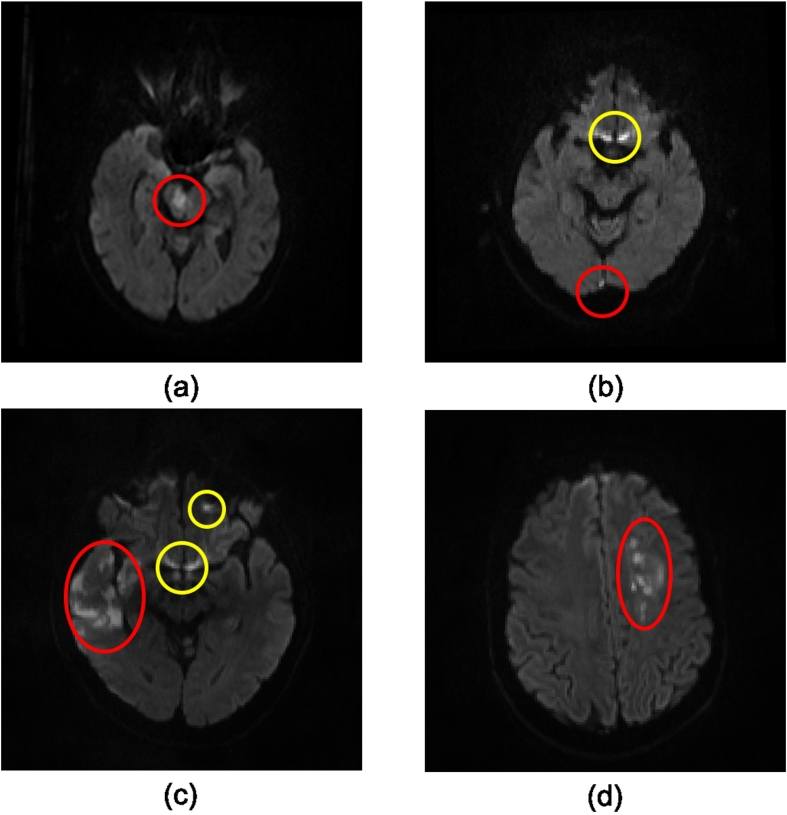
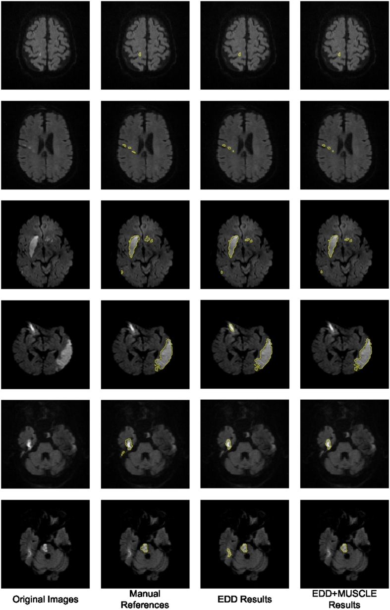

# Cerebral Infarction

## Goals

This disease chapter is designed to help a clinical-statistical reviewer:

1. Given a known diagnosis or suspected cerebral infarction context, describe
   how infarction commonly presents on diagnostic imaging, especially MRI and
   CT, using clinically realistic radiology-report language.
2. When reviewing diagnostic images or radiology reports, identify the imaging
   features, locations, structural patterns, report phrases, and clinical
   context that support or argue against cerebral infarction relative to
   similar-appearing conditions.
3. Translate infarct appearance, report language, disease course, and
   diagnostic uncertainty into research-design and statistical implications,
   including cohort definition, endpoint selection, covariates, adjudication,
   misclassification risk, and claims language.

## Source Review Status

Status: developing source-backed draft.

Supporting artifacts:

- Source review artifact: `cerebral-infarction.source-review.md`
- Source archive manifest: `cerebral-infarction.sources.json`
- Figure metadata manifest: `cerebral-infarction.figures.json`
- Research plan: `cerebral-infarction.research-plan.md`

This draft now has an expanded source pack. The manifest identifies well over
100 pages of relevant guideline, textbook-style, radiology teaching, review, and
open-access imaging-method material. It is ready for clinical review as a draft,
but not yet mature. More source extraction, report-language sampling, and expert
adjudication are needed before expert-review status.

## Figure Evidence

The current figure evidence includes both link-only teaching candidates and two
local embeddable CC BY figures from a PMC Open Access article package.

Figure: Examples of acute ischemic lesions in DWI. Source: Chen L, Bentley P,
Rueckert D. Fully automatic acute ischemic lesion segmentation in DWI using
convolutional neural networks. NeuroImage: Clinical. 2017. License: Creative
Commons Attribution 4.0 International License.

Figure: Original DWI, manual lesion annotations, and automated segmentation
examples for acute ischemic lesions. Source: Chen L, Bentley P, Rueckert D.
Fully automatic acute ischemic lesion segmentation in DWI using convolutional
neural networks. NeuroImage: Clinical. 2017. License: Creative Commons
Attribution 4.0 International License.

Starter figure candidates include:

- early CT signs of infarction from Radiology Assistant
- DWI examples in vascular territories from Radiology Assistant
- DWI/ADC pseudonormalization example from Radiology Assistant
- diffusion/perfusion mismatch example from Radiology Assistant
- a subacute infarct case mimicking tumor from Radiopaedia
- CC BY DWI lesion and segmentation examples from the PMC Open Access article
  package for Chen, Bentley, and Rueckert 2017

Use `cerebral-infarction.figures.json` for source URLs, reuse status, and
clinical points.

## Common Names And Aliases

- Primary name: Cerebral infarction.
- MR-RATE label: Cerebral infarction.
- SNOMED CT ID: 432504007.
- SNOMED CT label: Cerebral infarction.
- Original MR-RATE source name: Ischemic infarct.
- Abbreviations: AIS for acute ischemic stroke when acute clinical syndrome is
  meant; DWI-positive infarct when MRI diffusion evidence is the emphasis.
- Synonyms: ischemic stroke, brain infarct, ischemic infarct, completed
  infarct, territorial infarct, remote infarct, old infarct.
- Common report language: acute infarct, acute ischemia, restricted diffusion,
  evolving infarct, subacute infarct, chronic infarct, remote infarct,
  encephalomalacia, gliosis, no hemorrhagic transformation.
- Related but distinct entities: lacunar infarct, watershed infarct,
  encephalomalacia, gliosis, cerebral edema, cerebral hemorrhage, venous
  infarct, transient ischemic attack.

## Scope

This chapter covers cerebral ischemic infarction as an imaging finding,
diagnosis label, and research phenotype. It emphasizes brain MRI and CT
appearance across acute, subacute, and chronic stages.

It includes related MR-RATE labels when needed for interpretation:

- Lacunar infarct.
- Watershed infarct.
- Encephalomalacia.
- Gliosis.
- Cerebral edema.
- Cerebral hemorrhage when hemorrhagic transformation or mimic review matters.

It does not provide acute stroke triage, treatment eligibility, or patient-level
management instructions.

## Clinical Context

Cerebral infarction is irreversible brain tissue injury caused by insufficient
blood flow. In clinical practice it often appears in the context of acute
ischemic stroke, but radiology reports and datasets may also label chronic,
remote, incidental, or sequela-stage infarcts.

For clinical-statistical work, the key distinction is not only whether an
infarct is present, but what kind of infarct label is being used:

- acute symptomatic infarct
- subacute or evolving infarct
- chronic or remote infarct
- recurrent infarct
- infarct burden or volume
- infarct sequela such as encephalomalacia or gliosis
- uncertain infarct versus mimic

Those distinctions affect cohorts, endpoints, covariates, adjudication, and
claims.

## Known-Diagnosis Review Frame

When the diagnosis or suspected context is cerebral infarction, characterize:

- acuity: acute, subacute, chronic, recurrent, or uncertain
- lesion distribution: arterial territory, border-zone, lacunar/deep perforator,
  multifocal embolic, posterior fossa, or diffuse hypoxic-ischemic pattern
- lesion morphology: wedge-shaped cortical/subcortical region, small deep
  ovoid focus, gyriform cortical abnormality, cavitary chronic defect, or
  multifocal punctate lesions
- DWI/ADC relationship: true restricted diffusion versus T2 shine-through or
  chronic facilitated diffusion
- associated findings: edema, mass effect, hemorrhagic transformation,
  enhancement, vessel occlusion, perfusion deficit, encephalomalacia, gliosis,
  or ex vacuo change
- confidence and uncertainty: whether report language is definitive,
  favored/compatible, nonspecific, or mimic-aware

Ask for time from symptom onset, prior imaging, treatment history, vascular
imaging, available sequences, and clinical syndrome before drawing study-level
conclusions.

## What To Look For

### Acute Or Early Presentation

Acute cerebral infarction most often appears as a focal or territorial area of
restricted diffusion: bright on DWI with corresponding dark signal on ADC. The
abnormality may be punctate, wedge-shaped, cortical/subcortical, deep lacunar,
or distributed along an arterial territory. Early CT may be normal, or may show
subtle loss of gray-white differentiation, insular ribbon blurring, lentiform
nucleus obscuration, focal hypoattenuation, sulcal effacement, or a hyperdense
vessel sign.

- Symptoms or clinical syndrome: acute focal neurologic deficit, stroke-like
  presentation, or imaging-only acute infarct in a dataset.
- Timing: minutes to days after ischemic onset, depending on source and
  modality.
- Key imaging appearance: DWI hyperintensity with low ADC; early FLAIR/T2 can
  be normal or subtly bright.
- Distribution: vascular territory, border zone, perforator territory, or
  multifocal embolic pattern.
- Lesion morphology: wedge-shaped cortical/subcortical region, small ovoid deep
  focus, gyriform cortical abnormality, or multifocal punctate lesions.
- Diffusion, edema, hemorrhage, enhancement, or mass effect: diffusion
  restriction is central; edema/mass effect may evolve; SWI/GRE/CT help detect
  hemorrhage.
- Findings that should not be overcalled as chronic disease: acute DWI/low ADC
  lesions without volume loss or encephalomalacia.

### Subacute Or Evolving Presentation

Subacute infarction can be visually confusing. DWI may remain bright while ADC
begins to pseudonormalize, and T2/FLAIR signal becomes more conspicuous.
Gyriform or cortical enhancement can appear, edema and mass effect can peak,
and hemorrhagic transformation may be seen on CT or SWI/GRE. A subacute infarct
can look mass-like or tumor-like, especially when enhancement and edema are
present.

- Expected evolution from acute imaging: DWI remains bright initially; ADC
  rises toward normal; FLAIR/T2 abnormality becomes more obvious.
- T1/T2/FLAIR appearance in concrete visual terms: swollen cortical ribbon or
  wedge-shaped bright FLAIR/T2 region, sometimes with cortical T1 signal if
  laminar necrosis is present.
- Enhancement or diffusion evolution: gyriform enhancement and ADC
  pseudonormalization can create timing pitfalls.
- Volume loss, cavitation, atrophy, or structural remodeling: usually not
  dominant early, but begins as tissue injury resolves.
- Features that suggest stabilization versus ongoing active disease:
  decreasing edema/mass effect and expected infarct evolution support
  stabilization; new diffusion lesions, enlarging abnormality, or unexpected
  enhancement/mass effect should trigger mimic review.

### Chronic Or Stable Residual Presentation

Chronic infarction is usually a residual structural injury rather than active
ischemia. It may appear as an encephalomalacic cavity, CSF-like tissue loss,
volume loss, cortical thinning, ex vacuo ventricular or sulcal enlargement, and
surrounding FLAIR hyperintense gliosis. DWI is not expected to show true acute
restriction; ADC may be high because diffusion is facilitated in chronic tissue
loss.

- T2/FLAIR appearance in concrete visual terms: gliotic bright rim or patch
  around tissue loss; chronic white matter or cortical/subcortical signal in a
  prior infarct territory.
- T1 appearance: low signal in chronic tissue loss or cavitation.
- Volume loss, tissue loss, cavitation, atrophy, or ex vacuo change: central
  evidence for chronicity.
- Absence or expected pattern of diffusion restriction: no true low ADC
  restricted diffusion in purely chronic infarct.
- Absence or expected pattern of enhancement: persistent or progressive
  enhancement should trigger caution and mimic review.
- Expected stability on prior imaging: stable lesion size and morphology
  support a chronic residual label.
- Functional or outcome implications: chronic infarct burden can represent
  prior event history, disability risk, vascular disease burden, or
  misclassification risk depending on study design.

### Progressive, Recurrent, Or Worsening Presentation

Progression or recurrence may appear as new DWI/low ADC lesions, extension into
a larger vascular territory, worsening edema/mass effect, new hemorrhagic
transformation, new vessel occlusion, increasing perfusion deficit, or new
infarcts in additional territories.

- Interval enlargement, new lesions, or increasing lesion burden: supports
  recurrent, evolving, or multifocal infarction rather than stable chronic
  change.
- Increasing mass effect, edema, enhancement, diffusion restriction,
  susceptibility, perfusion, spectroscopy, or other active findings: should be
  described specifically.
- Location or morphology changes that should trigger caution: nonvascular
  expansion, persistent mass-like behavior, or enhancement that does not follow
  expected infarct evolution.
- Mimics that become more likely with this pattern: tumor, infection,
  demyelination, seizure-related change, venous infarct, vasculitis, and
  treatment-related injury.

### Improving, Resolving, Or Treatment-Response Presentation

Improvement in active infarct imaging usually means reduction of edema, mass
effect, perfusion deficit, or active diffusion abnormality over time. Chronic
sequelae such as encephalomalacia, gliosis, tissue loss, and ex vacuo change
may persist even when the acute process has stabilized.

- Findings expected to improve: edema, mass effect, acute diffusion restriction
  pattern, perfusion deficit, and some enhancement patterns.
- Findings expected to persist: chronic tissue loss, gliosis,
  encephalomalacia, cortical volume loss, and residual cavity.
- Time-course caveats: ADC pseudonormalization does not mean tissue recovery;
  subacute enhancement can persist and should be interpreted with timing.
- Measurement pitfalls: protocol differences, slice thickness, motion,
  incomplete sequence availability, and lack of prior imaging.

### Context Clues

- Known diagnosis or suspected etiology: embolic, thrombotic, small-vessel,
  watershed, hypoperfusion, dissection, vasculitis, or postoperative.
- Prior imaging: essential for distinguishing new infarct from remote infarct.
- Treatment history: thrombolysis, thrombectomy, antithrombotic therapy,
  decompression, rehabilitation, or secondary prevention can affect timing and
  outcomes.
- Relevant comorbidities: atrial fibrillation, hypertension, diabetes,
  hyperlipidemia, vascular stenosis, prior stroke, malignancy, infection,
  coagulopathy, or inflammatory disease.
- Reference standard or adjudication needs: clinical syndrome, vascular
  imaging, follow-up MRI/CT, expert neuroradiology review, or outcome data.

### Report Language Patterns

Findings-style language describes what is seen:

- "Small focus of restricted diffusion in the left centrum semiovale with
  corresponding low ADC."
- "Wedge-shaped cortical and subcortical FLAIR hyperintensity in the right MCA
  territory."
- "Loss of gray-white differentiation and sulcal effacement involving the left
  insula and basal ganglia."
- "No susceptibility blooming to suggest hemorrhagic transformation."
- "Remote right cerebellar infarct with encephalomalacia and surrounding
  gliosis."
- "Compared with prior imaging, the diffusion abnormality has resolved with
  residual volume loss."

Impression-style language synthesizes meaning:

- "Acute infarct in the left MCA territory."
- "Small acute lacunar infarct in the right thalamus."
- "Evolving subacute infarct with expected gyriform enhancement."
- "Remote infarct with encephalomalacia/gliosis; no acute infarct."
- "Findings favor subacute infarct, although follow-up is recommended because
  a mass-like mimic is not fully excluded."

Uncertainty and cohort-label language:

- Confident label: "acute infarct", "acute ischemic infarct", "remote
  infarct", "chronic infarct".
- Probable/favored label: "favored to represent subacute infarct",
  "compatible with evolving infarct".
- Low-confidence or nonspecific phrases: "nonspecific diffusion signal",
  "DWI hyperintensity without definite low ADC", "T2 shine-through".
- Adjudication triggers: "tumor not excluded", "atypical for infarct",
  "nonvascular distribution", "recommend follow-up", "seizure-related change
  could appear similar".

## Primary Imaging Modality

MRI is the most informative modality for lesion characterization when available,
especially for small, early, posterior fossa, multifocal, or uncertain infarcts.

- T1: may be normal early; can become hypointense with tissue injury; chronic
  infarcts may show tissue loss; cortical laminar necrosis can produce intrinsic
  cortical T1 signal.
- T2: becomes bright as edema and tissue injury evolve; chronic infarct can
  remain bright around gliosis or tissue loss.
- FLAIR: useful for parenchymal edema, chronic gliosis, and DWI-FLAIR timing
  context; may be negative very early.
- DWI/ADC: core sequence pair for acute infarct detection; true restriction is
  bright DWI with low ADC.
- SWI/GRE: detects hemorrhagic transformation, microhemorrhage, thrombus,
  mineralization, or hemorrhagic mimics.
- Post-contrast T1: can show subacute gyriform enhancement; persistent or
  atypical enhancement should trigger mimic review.
- Perfusion, spectroscopy, tractography, volumetry, or other advanced methods:
  perfusion can help evaluate core/penumbra or mismatch; spectroscopy and
  perfusion may help when tumor mimic is a concern.

## Other Modalities And When They Matter

- Noncontrast CT: rapid first-line acute imaging in many settings, especially
  to exclude hemorrhage and identify early ischemic signs.
- CTA/MRA: evaluate vessel occlusion, stenosis, dissection, aneurysm, or other
  vascular context.
- CT perfusion/MR perfusion: estimate infarct core, tissue at risk, and
  perfusion mismatch in selected acute or uncertain cases.
- Catheter angiography: reserved for selected diagnostic or interventional
  vascular contexts.
- Vascular ultrasound: carotid or transcranial Doppler context may support
  stroke mechanism assessment.
- PET/SPECT: uncommon for routine infarct diagnosis; may matter in specialized
  perfusion/metabolic research contexts.
- Pathology/laboratory/genetic testing: relevant when vasculitis, infection,
  malignancy, hypercoagulability, or genetic arteriopathy is in scope.

## Locations And Structural Appearance

- Cortical: gyriform or wedge-shaped cortical/subcortical abnormality, often
  following an arterial territory.
- Subcortical: deep white matter or centrum semiovale lesions may be lacunar,
  embolic, or border-zone depending on pattern and context.
- Deep white matter: punctate or confluent lesions require distinction from
  chronic small vessel disease and demyelination.
- Periventricular: infarcts can occur but periventricular FLAIR lesions are
  often nonspecific; use DWI/ADC and distribution.
- Corpus callosum: infarction is possible but less common; consider
  demyelination, diffuse axonal injury, tumor, and cytotoxic lesions.
- Deep gray nuclei: basal ganglia, thalamus, and internal capsule infarcts
  often suggest perforator or MCA/PCA territory involvement.
- Brainstem: small infarcts can be clinically important and can be missed if
  imaging is early or degraded.
- Cerebellum: posterior circulation infarcts may produce edema, mass effect,
  hydrocephalus, and chronic cavitary defects.
- Hippocampus or mesial temporal structures: consider PCA territory infarct,
  seizure-related change, hypoxic injury, encephalitis, or transient global
  amnesia mimics depending on pattern.
- Postoperative, post-treatment, or post-injury regions: infarct can coexist
  with surgical injury, radiation effect, tumor, hemorrhage, or gliosis.
- Vascular-territory, tract-like, multifocal, diffuse, symmetric, asymmetric,
  mass-like, cavitary, atrophic, or volume-loss patterns: pattern is often the
  fastest way to distinguish infarct from mimic.

## Typical Appearance

Typical acute cerebral infarction is a DWI-bright, ADC-dark lesion in a
vascular distribution, often with subtle or evolving FLAIR/T2 signal and no
primary mass-like growth. Typical chronic infarction shows tissue loss,
encephalomalacia, gliosis, facilitated diffusion, and stability over time.

## Atypical Or Red-Flag Appearance

Red flags include:

- nonvascular distribution
- progressive expansile mass-like behavior
- persistent or nodular enhancement beyond expected evolution
- DWI hyperintensity without convincing ADC reduction
- extensive enhancement or edema out of proportion to expected infarct timing
- multifocal lesions not explained by embolic or watershed pattern
- prominent hemorrhage without ischemic pattern
- lack of expected interval evolution
- missing DWI/ADC, SWI/GRE, contrast, perfusion, or prior imaging when needed

## Differential Diagnosis And Mimics

Use this section for questions such as "what else could this be?", "what
imaging features support cerebral infarction?", and "what would make a
similar-appearing diagnosis more likely?"

### Quick Differential Diagnosis Guide

- Most important mimic: seizure-related cortical signal abnormality, because it
  can show DWI/FLAIR changes and may resolve.
- High-risk mimic that should trigger adjudication: tumor or infection when
  enhancement, edema, or mass-like behavior is atypical.
- Common benign or nonspecific mimic: chronic small vessel ischemic white
  matter change without acute infarction.
- Treatment-related mimic: posttreatment radiation or surgical change when
  vascular injury, necrosis, and gliosis overlap.
- Mimic most affected by timing or interval change: subacute infarct versus
  glioma, because follow-up can clarify evolution.

### Key Imaging Discriminators

- location and distribution: arterial territory, border-zone, perforator, or
  embolic distribution supports infarct.
- lesion morphology: wedge-shaped cortical/subcortical lesion or small deep
  ovoid lacune supports vascular injury.
- mass effect, edema, or expansile behavior: expected edema can occur, but
  progressive expansion out of proportion to timing suggests mimic.
- diffusion or ADC pattern: true acute restriction is bright DWI with low ADC;
  T2 shine-through is less supportive.
- enhancement pattern: subacute gyriform enhancement can support infarct;
  nodular or progressive enhancement raises concern.
- susceptibility, hemorrhage, mineralization, or blood products: SWI/GRE/CT
  help distinguish hemorrhagic transformation from primary hemorrhage or
  cavernoma.
- perfusion, spectroscopy, PET, or other advanced imaging: perfusion mismatch
  can support acute stroke workflow; elevated tumor perfusion or spectroscopy
  may argue against infarct.
- volume loss, tissue loss, cavitation, atrophy, or ex vacuo change: supports
  chronic infarct sequela rather than active infarct.
- interval change and stability: expected infarct evolution supports diagnosis;
  unexpected growth should trigger review.
- clinical, pathology, treatment, laboratory, or genetic context: vascular risk
  factors, acute syndrome, embolic source, infection, malignancy, seizure, or
  treatment history can change interpretation.

### Differential Diagnosis Matrix

| Comparator | Why it can look similar | Features supporting this disease/finding | Features arguing against this disease/finding | Helpful sequences or context | Example report language | Statistical or cohort implication |
| --- | --- | --- | --- | --- | --- | --- |
| Seizure-related signal abnormality | Can show cortical DWI/FLAIR signal, swelling, and clinical stroke-like symptoms. | Arterial-territory pattern, low ADC, vessel occlusion, expected infarct evolution. | Nonvascular cortical pattern, rapid resolution, seizure history, perfusion pattern inconsistent with infarct. | EEG, perfusion, follow-up MRI, clinical history. | "peri-ictal change could appear similar" | Exclude or adjudicate if acute infarct label is uncertain. |
| Low-grade glioma or other tumor | Subacute infarct can enhance and look mass-like. | Vascular distribution, DWI/ADC evolution, decreasing edema/mass effect. | Progressive infiltrative expansion, persistent enhancement, elevated perfusion, tumor spectroscopy. | Follow-up MRI, perfusion, spectroscopy, oncology history. | "subacute infarct favored; neoplasm not excluded" | Do not use as clean infarct endpoint without follow-up/adjudication. |
| Demyelinating lesion | Can produce T2/FLAIR hyperintensity, enhancement, and restricted diffusion. | Vascular territory and infarct timing. | Ovoid periventricular/callosal lesions, open-ring enhancement, dissemination in time/space. | MS history, spine/orbit MRI, CSF, prior imaging. | "demyelinating plaque is a consideration" | Separate demyelinating disease labels from infarct labels. |
| Intracranial hemorrhage | Acute deficits overlap; infarcts can transform hemorrhagically. | Ischemic pattern with DWI/ADC restriction and secondary blood products. | Primary hematoma without infarct distribution or diffusion pattern. | NCCT, SWI/GRE, CTA, anticoagulation history. | "hemorrhagic transformation of infarct" | Separate ischemic infarct with hemorrhagic transformation from primary hemorrhage. |
| Venous infarction | Can show edema, hemorrhage, and restricted diffusion. | Arterial-territory infarct and arterial occlusion. | Venous sinus thrombosis, nonarterial distribution, hemorrhagic edema crossing territories. | MRV/CTV, SWI/GRE, venous anatomy. | "venous infarct not excluded" | Usually requires separate label or adjudication. |
| Chronic gliosis / encephalomalacia | Remote infarct sequelae can be labeled as infarct. | Vascular-territory tissue loss and prior infarct history. | No acute DWI/low ADC restriction, stable chronic cavity. | Prior imaging, DWI/ADC, FLAIR, T1. | "remote infarct with encephalomalacia/gliosis" | Separate prevalent chronic disease from incident acute endpoint. |

### Similar-Presentation Diseases And Mimic-Aware Comparison

The practical question is whether the imaging pattern behaves like vascular
tissue injury over time. Acute cerebral infarction should usually have true
restricted diffusion in a plausible vascular distribution, with CT/FLAIR/T2 and
enhancement evolving in a time-consistent way. Mimics become more likely when
the distribution is nonvascular, enhancement is nodular or progressive, edema
is disproportionate, the lesion resolves too quickly for infarct, or prior
imaging shows a longstanding abnormality.

### Report Language That Supports Or Argues Against Each Diagnosis

- Findings phrases that support the label: "restricted diffusion with low ADC",
  "vascular territory", "loss of gray-white differentiation", "sulcal
  effacement", "remote encephalomalacia".
- Impression phrases that support the label: "acute infarct", "evolving
  infarct", "subacute infarct", "remote infarct", "chronic infarct".
- Phrases that suggest a mimic: "nonvascular distribution", "mass-like",
  "neoplasm not excluded", "demyelinating lesion", "postictal change".
- Phrases that indicate uncertainty: "favored", "compatible with", "could
  represent", "follow-up recommended".
- Phrases that should trigger exclusion, adjudication, or sensitivity analysis:
  "atypical for infarct", "tumor not excluded", "no definite low ADC",
  "artifact limits evaluation", "no prior comparison".

### When Additional Imaging Or Clinical Context Helps

Additional context is important when acuity, mechanism, or mimic risk affects
the research label. Seek prior imaging, DWI/ADC, SWI/GRE, vascular imaging,
perfusion imaging, contrast-enhanced MRI, follow-up MRI, EEG, laboratory data,
treatment history, and expert neuroradiology adjudication when the label is not
straightforward.

## Natural History And Clinical Course

Cerebral infarction evolves from acute cytotoxic edema and restricted diffusion
to subacute edema, enhancement, ADC pseudonormalization, and then chronic
tissue loss, gliosis, and encephalomalacia. The clinical course depends on
infarct size, territory, reperfusion, complications, recurrent events, vascular
risk factors, and treatment context.

## Treatment, Response, And Outcome Context

This section provides research context only. Treatment eligibility and acute
stroke triage must remain outside this chapter.

### Guideline-Based Management Context

- society or organization: AHA/ASA, ACR, NICE, and ESO are starter
  guideline/criteria sources.
- guideline title: AHA/ASA 2026 acute ischemic stroke guideline; ACR
  Appropriateness Criteria for cerebrovascular diseases and stroke-related
  conditions; NICE NG128; ESO intravenous thrombolysis guideline.
- publication year or version: AHA/ASA 2026 guideline; ACR 2024 criteria; NICE
  2022 update; ESO 2021 guideline.
- jurisdiction or population: broad adult stroke imaging and acute ischemic
  stroke contexts; check source-specific variants.
- evidence level or recommendation strength when available: see original
  guideline/criteria sources.
- disease stage, phenotype, severity group, or subgroup covered: acute
  ischemic stroke, completed infarct, vascular occlusion, hemorrhage exclusion,
  and stroke-related imaging scenarios.
- how the guideline changes imaging interpretation, follow-up, endpoint
  definition, or claims: acute treatment-window context makes timing, DWI-FLAIR
  mismatch, vascular imaging, and perfusion imaging important covariates or
  eligibility variables.

### Common Treatment Pathways

Treatment pathways that can affect research interpretation include:

- emergency imaging and stroke-team workflow
- thrombolysis or thrombectomy in eligible acute cases
- antithrombotic and secondary-prevention therapy
- decompressive surgery in selected severe edema contexts
- rehabilitation and supportive care
- risk-factor management and recurrence prevention

Do not infer treatment eligibility from this chapter.

### Imaging Appearance After Treatment

Posttreatment imaging may show reperfusion, infarct growth despite treatment,
hemorrhagic transformation, edema/mass effect, procedure-related findings,
resolving diffusion abnormality, or chronic residual encephalomalacia/gliosis.
Treatment history is therefore a covariate, not background noise.

### Evidence Of Treatment Response

Response can be reflected by clinical improvement, vessel recanalization,
reduced perfusion deficit, absence of infarct expansion, decreasing edema/mass
effect, or stable chronic residual change. Imaging response should be linked to
timing and treatment type.

### Evidence Of Progression, Recurrence, Or Treatment Failure

Progression or complication may be suggested by:

- new infarcts
- enlarging infarct core
- new or worsening edema/mass effect
- hemorrhagic transformation
- persistent vessel occlusion
- recurrent vascular territory lesions
- clinical worsening or recurrent symptoms

### Expected Outcomes And Prognostic Factors

Relevant outcomes include functional status, disability, recurrent stroke,
hemorrhagic transformation, infarct volume, edema/mass effect, mortality,
length of stay, rehabilitation needs, and chronic cognitive or neurologic
deficits. Prognostic factors may include age, baseline severity, infarct
territory, lesion volume, vessel occlusion, reperfusion status, hemorrhagic
transformation, comorbidities, prior stroke, and treatment timing.

### Statistical Implications Of Treatment And Progression

Treatment and progression can create:

- confounding by indication
- treatment-window bias
- immortal time bias
- lead-time bias
- informative censoring
- competing risks
- treatment-era effects
- endpoint ambiguity between acute infarct, infarct growth, recurrent infarct,
  and chronic sequela
- adjudication requirements
- sensitivity analyses by treatment, timing, vessel occlusion, and baseline
  severity

## Evidence Of Active Disease, Progression, Or Recurrence

Active or new infarction is supported by true restricted diffusion, new FLAIR/T2
abnormality, new vessel occlusion, perfusion deficit, new edema/mass effect,
or new lesions compared with prior imaging. Recurrent infarction should be
distinguished from evolution of a known infarct.

## Stable Or Chronic Residual Findings

Stable chronic infarct is supported by tissue loss, encephalomalacia, gliosis,
CSF-like cavity, ex vacuo change, facilitated diffusion, and stable appearance
on prior imaging. Chronic findings should not be treated as incident acute
events unless the research question explicitly uses history or burden.

## Improvement, Treatment Response, Or Resolution

Acute diffusion abnormality, edema, mass effect, enhancement, and perfusion
abnormality may improve or evolve. Chronic tissue loss and gliosis may persist.
ADC pseudonormalization or DWI washout should not be interpreted as complete
recovery without clinical and imaging context.

## Serial Imaging Assessment And Interval Change

Compare studies by sequence, timing, and protocol. Meaningful interval review
should ask:

- Is there a new DWI/low ADC lesion?
- Has FLAIR/T2 abnormality increased, decreased, or stabilized?
- Has edema or mass effect changed?
- Is enhancement expected for subacute infarct or atypical?
- Is hemorrhagic transformation new or resolving?
- Is chronic encephalomalacia/gliosis stable?
- Are scanner/protocol differences limiting comparison?

## Clinical Endpoints

Potential clinical endpoints include:

- acute ischemic stroke event
- recurrent ischemic stroke
- neurologic deficit severity
- functional outcome
- disability progression or recovery
- mortality
- hemorrhagic transformation
- need for intervention or decompression
- rehabilitation disposition
- recurrent hospitalization

## Imaging, Biomarker, And Measurement Endpoints

Potential imaging endpoints include:

- DWI lesion presence
- infarct volume or burden
- vascular territory
- lesion number and distribution
- DWI/ADC timing pattern
- FLAIR lesion burden
- perfusion deficit or mismatch
- vessel occlusion/recanalization
- edema and mass effect
- hemorrhagic transformation
- chronic encephalomalacia/gliosis volume
- ASPECTS or other imaging scores when source-supported

Measurement pitfalls include missing sequences, different scanners/protocols,
motion, slice thickness, reader variability, lesion segmentation methods,
co-registration, and lack of prior imaging.

## Common Covariates And Confounders

### Clinical Covariates

- demographics: age, sex, race/ethnicity when relevant to study question
- disease duration, onset timing, or symptom timing: last known well, symptom
  onset, imaging time, unclear onset
- comorbidities: hypertension, diabetes, atrial fibrillation, dyslipidemia,
  smoking, prior stroke, vascular disease, coagulopathy, malignancy
- disease severity, phenotype, stage, or subtype: NIHSS or equivalent severity,
  acute/subacute/chronic stage, territorial/lacunar/watershed pattern
- prior events or recurrence history: prior infarcts, TIA, hemorrhage
- laboratory, pathology, molecular, genetic, or physiologic data: glucose,
  coagulation, hypercoagulability workup, inflammatory markers when relevant
- clinical indication for imaging: acute deficit, follow-up, incidental MRI,
  surveillance, research cohort inclusion

### Imaging Covariates

- modality and sequences available: CT, CTA, CTP, MRI, DWI, ADC, FLAIR, T2,
  SWI/GRE, contrast, perfusion
- scanner/site/protocol: field strength, vendor, acute stroke protocol, slice
  thickness, motion
- lesion location, laterality, burden, volume, number, or distribution:
  vascular territory, border-zone, lacunar, posterior fossa, multifocal
- enhancement, diffusion, susceptibility, perfusion, spectroscopy, or PET
  features: needed for acuity and mimic review
- prior imaging availability and comparison interval: essential for incident
  versus chronic labels
- reader expertise, adjudication, and measurement method: radiology report,
  expert review, automated segmentation, consensus label

### Treatment And Temporal Confounders

- treatment exposure and line of therapy: thrombolysis, thrombectomy,
  antithrombotics, decompression, rehabilitation
- surgery, radiation, procedure, or device history: can create vascular injury,
  treatment effect, or mimic
- time from treatment, injury, relapse, recurrence, infection, or event:
  determines imaging appearance
- response, progression, recurrence, or relapse status: endpoint definition
  depends on timing
- treatment switching, rescue treatment, rehabilitation, or supportive care:
  can affect outcomes
- surveillance intensity and follow-up schedule: can affect detection of
  recurrent or incidental infarcts

### Acquisition And Protocol Confounders

- scanner field strength
- sequence parameters
- slice thickness and reconstruction
- contrast timing and dose
- motion or artifact
- site, vendor, protocol, or calendar-time changes
- missing DWI/ADC, SWI/GRE, perfusion, or prior studies
- noncomparable acute CT and later MRI

### Research Design Implications

- variables to adjust for: age, vascular risk factors, onset-to-imaging time,
  treatment, scanner/site, lesion size, prior stroke, severity
- variables to stratify by: acute/subacute/chronic, territory, lacunar versus
  nonlacunar, treatment status, vessel occlusion, hemorrhagic transformation
- variables that define eligibility or exclusion: confirmed DWI/ADC lesion,
  chronic-only infarct, mimic concern, inadequate imaging, missing prior
  imaging
- variables that require adjudication: subacute mass-like lesion, uncertain
  DWI/ADC, tumor/demyelination mimic, venous infarct, hemorrhagic transformation
- variables that should be used in sensitivity analysis: report certainty,
  modality availability, chronicity, prior infarct history, treatment window
- variables that limit claims language: label source, timing uncertainty,
  incomplete imaging, missing clinical severity, no adjudication

## Statistical Implications

Cerebral infarction can be a cohort label, endpoint, baseline comorbidity,
imaging biomarker, safety event, or competing event. The analysis must specify
which one.

Key implications:

- Cohort definition: decide whether to include acute infarct, chronic infarct,
  remote infarct, or any MR-RATE cerebral infarction label.
- Eligibility and exclusion criteria: separate clean acute infarct cohorts from
  chronic sequela, mimics, and uncertain labels when needed.
- Label certainty: report language and sequence availability determine whether
  a label is high confidence.
- Adjudication: needed for subacute mimics, missing ADC, atypical enhancement,
  or conflicting CT/MRI findings.
- Endpoint choice: incident infarct, recurrent infarct, infarct volume,
  hemorrhagic transformation, functional outcome, or chronic sequela are not
  interchangeable.
- Model selection: time-to-event, longitudinal, diagnostic accuracy,
  prediction, segmentation, and causal models may all be relevant depending on
  question.
- Covariate adjustment: vascular risk, severity, timing, treatment, prior
  infarct, scanner/site, and protocol are often essential.
- Subgroup analysis: territory, lacunar/watershed pattern, treatment status,
  age group, prior stroke, and vessel occlusion can matter.
- Sensitivity analysis: exclude uncertain report phrases, chronic-only labels,
  missing DWI/ADC, or mimic concern.
- Missing data: missing onset time, prior imaging, DWI/ADC, vascular imaging,
  treatment status, or severity can bias results.
- Multiplicity: many imaging endpoints require prespecified hierarchy.
- Claims language: use "associated with", "compatible with", or "supports a
  research label" when evidence is observational or label confidence is limited.

For segmentation or automated measurement studies, record whether the endpoint
comes from the radiology report, manual annotation, semi-automatic measurement,
or fully automatic segmentation. DWI lesion volume, final infarct volume, and
chronic tissue-loss volume are different endpoints and should not be collapsed
without a prespecified mapping.

## Missing Information To Ask For

- What is the task: known-diagnosis characterization, report extraction, cohort
  definition, endpoint design, or mimic review?
- Is the intended label acute cerebral infarction, chronic infarct, prior
  infarct history, or any MR-RATE cerebral infarction label?
- What imaging is available: CT, CTA, CTP, MRI, DWI, ADC, FLAIR, SWI/GRE,
  contrast, perfusion?
- What is the time from symptom onset or last known well?
- Is prior imaging available?
- Is there treatment history?
- Is there vascular imaging or vessel-occlusion information?
- Is there hemorrhage, edema, mass effect, or enhancement?
- Does the report express uncertainty or mention mimics?
- Is expert adjudication available?

## Safety And Claim Boundaries

This chapter may help with research planning, imaging-review structure,
radiology-report language interpretation, cohort labels, endpoints, covariates,
adjudication, and statistical claims.

Keep out of scope:

- emergency stroke triage
- treatment eligibility
- patient-level management
- final diagnosis
- unsupported prognostic claims
- claims that an MR-RATE label alone proves acuity, mechanism, treatment
  response, or clinical outcome

## Related Disease Files

- `gliosis.md`: chronic sequela and mimic/context chapter.
- `encephalomalacia.md`: should be created later as a chronic sequela chapter.
- `lacunar-infarct.md`: should be created later if lacunar-specific evidence is
  needed.
- `watershed-infarct.md`: should be created later if border-zone mechanism and
  hemodynamic context are central.
- `cerebral-hemorrhage.md`: related for hemorrhagic transformation and primary
  hemorrhage distinction.
- `demyelinating-disease-of-central-nervous-system.md`: mimic chapter to create
  later.
- `glioma.md`: mass-like mimic chapter to create later.

## Related Statistical Method Files

- diagnostic test performance
- inter-reader adjudication
- time-to-event analysis
- competing risks
- longitudinal imaging endpoints
- causal inference and confounding by indication
- measurement error and misclassification

## Authoritative Sources

Use `cerebral-infarction.sources.json` as the source manifest.

### Broad Clinical And Imaging Sources

- ACR Appropriateness Criteria: Cerebrovascular Diseases-Stroke and
  Stroke-Related Conditions.
- AHA/ASA 2026 acute ischemic stroke guideline and supporting professional
  summary.
- NICE NG128 stroke and TIA diagnosis and initial management guideline.
- ESO intravenous thrombolysis guideline, including DWI-FLAIR and
  core/perfusion mismatch context.
- NCBI Bookshelf: Stroke Imaging.
- NCBI Bookshelf: Ischemic Stroke.
- Radiology Assistant: Imaging in Acute Stroke.
- Broad MRI acute ischemic stroke review.

### Narrow Technical Or Supporting Sources

- ADC/DWI/T2 signal evolution study for lesion timing.
- Chen, Bentley, and Rueckert 2017 CC BY open-access DWI lesion segmentation
  article for local reusable figures and segmentation-method context.
- Radiopaedia DWI acute ischemic stroke reference article.
- Radiopaedia subacute cerebral infarction case for tumor-mimic/follow-up
  teaching.

## Notes For Skill Authors

Keep this chapter MR-RATE aligned. The formal disease label is Cerebral
infarction, but users may ask for ischemic stroke, acute infarct, remote
infarct, DWI-positive stroke, lacunar infarct, watershed infarct, or chronic
encephalomalacia/gliosis. Route broad acute treatment questions away from this
chapter and toward appropriate clinical sources; use this chapter for research
interpretation, not care decisions.
